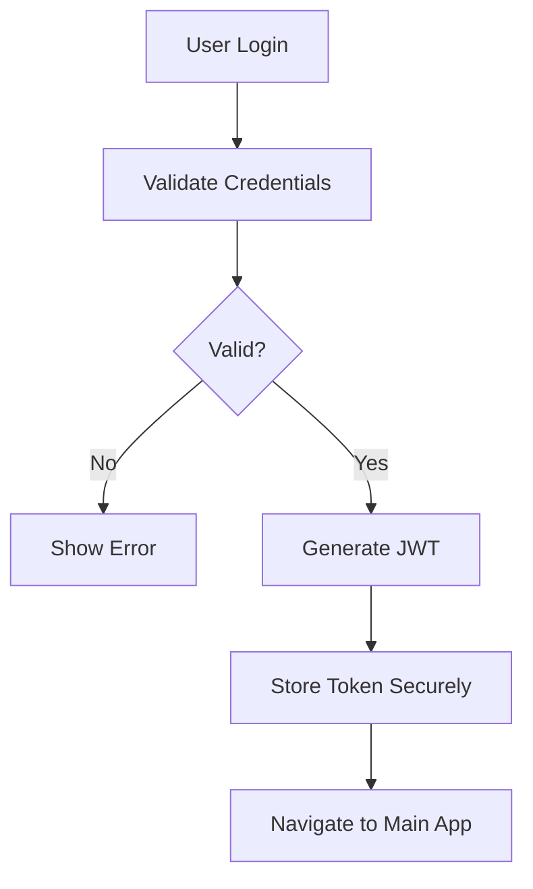

# Architecture Guide

## Overview

Katya AI REChain Mesh follows Clean Architecture principles with separation of concerns across multiple layers. This guide explains the project structure and architectural decisions.

## Architecture Layers

```
┌─────────────────────────────────────────────────────────────┐
│                    Presentation Layer                       │
│  UI Components, Screens, Widgets, Navigation               │
├─────────────────────────────────────────────────────────────┤
│                   Application Layer                         │
│  State Management, Business Logic, Use Cases               │
├─────────────────────────────────────────────────────────────┤
│                    Domain Layer                             │
│  Entities, Models, Repository Interfaces, Use Cases         │
├─────────────────────────────────────────────────────────────┤
│                Infrastructure Layer                         │
│  External Services, Storage, Network, Platform APIs        │
└─────────────────────────────────────────────────────────────┘
```

## Project Structure

```
lib/
├── src/
│   ├── models/           # Domain entities and data models
│   ├── services/         # External services and API clients
│   ├── state/           # Application state management
│   ├── ui/              # Presentation layer components
│   ├── theme/           # Styling and theming
│   └── utils/           # Utilities and helpers
├── main.dart            # Application entry point
└── ...

android/                 # Android platform-specific code
ios/                     # iOS platform-specific code
web/                     # Web platform-specific code
linux/                   # Linux desktop code
windows/                 # Windows desktop code
macos/                   # macOS desktop code
```

## Domain Layer

### Models (lib/src/models/)

Domain entities represent the core business objects:

```dart
// Blockchain models
class Wallet {
  final String id;
  final String address;
  final String network;
  final double balance;
  // ...
}

// Gaming models
class UserProgress {
  final String userId;
  final int level;
  final int experience;
  final int coins;
  final int gems;
  // ...
}

// IoT models
class IoTDevice {
  final String id;
  final String name;
  final IoTDeviceType type;
  final bool isConnected;
  // ...
}

// Social models
class UserProfile {
  final String userId;
  final String username;
  final String displayName;
  final List<String> interests;
  // ...
}
```

### Repository Interfaces

Abstract interfaces define contracts for data access:

```dart
abstract class BlockchainRepository {
  Future<List<Wallet>> getWallets();
  Future<Wallet> createWallet(CreateWalletRequest request);
  Future<TransactionResult> sendTransaction(SendTransactionRequest request);
  Stream<Transaction> getTransactionUpdates();
}

abstract class GamingRepository {
  Future<UserProgress> getUserProgress(String userId);
  Future<bool> purchaseReward(String userId, String rewardId);
  Stream<Achievement> getAchievementUpdates();
}
```

## Application Layer

### State Management (lib/src/state/)

Each module has its own state controller using Provider pattern:

```dart
class BlockchainState extends ChangeNotifier {
  final BlockchainRepository _repository;
  List<Wallet> _wallets = [];
  bool _isLoading = false;

  List<Wallet> get wallets => List.unmodifiable(_wallets);
  bool get isLoading => _isLoading;

  Future<void> loadWallets() async {
    _isLoading = true;
    notifyListeners();

    try {
      _wallets = await _repository.getWallets();
    } catch (error) {
      // Handle error
    } finally {
      _isLoading = false;
      notifyListeners();
    }
  }
}
```

### Services (lib/src/services/)

Business logic and external API integration:

```dart
class BlockchainService implements BlockchainRepository {
  final Web3Client _client;
  final String _apiKey;

  @override
  Future<List<Wallet>> getWallets() async {
    // Implementation
  }

  @override
  Future<TransactionResult> sendTransaction(SendTransactionRequest request) async {
    // Implementation
  }
}
```

## Presentation Layer

### UI Components (lib/src/ui/)

Reusable UI components following Material Design:

```dart
class WalletCard extends StatelessWidget {
  final Wallet wallet;
  final VoidCallback onTap;

  const WalletCard({
    Key? key,
    required this.wallet,
    required this.onTap,
  });

  @override
  Widget build(BuildContext context) {
    return Card(
      child: ListTile(
        leading: NetworkIcon(network: wallet.network),
        title: Text(wallet.name),
        subtitle: Text('${wallet.balance} ${wallet.symbol}'),
        trailing: Icon(Icons.arrow_forward),
        onTap: onTap,
      ),
    );
  }
}
```

### Screens (lib/src/ui/screens/)

Main application screens:

```dart
class BlockchainPage extends StatelessWidget {
  @override
  Widget build(BuildContext context) {
    final state = context.watch<BlockchainState>();

    return Scaffold(
      appBar: AppBar(title: Text('Blockchain')),
      body: state.isLoading
          ? Center(child: CircularProgressIndicator())
          : ListView.builder(
              itemCount: state.wallets.length,
              itemBuilder: (context, index) {
                final wallet = state.wallets[index];
                return WalletCard(
                  wallet: wallet,
                  onTap: () => _showWalletDetails(context, wallet),
                );
              },
            ),
      floatingActionButton: FloatingActionButton(
        onPressed: () => _showCreateWalletDialog(context),
        child: Icon(Icons.add),
      ),
    );
  }
}
```

## Infrastructure Layer

### External Services

#### Blockchain Integration
```dart
class BlockchainService extends BlockchainRepository {
  final Web3Client _ethClient;
  final PolygonClient _polygonClient;
  final BscClient _bscClient;

  @override
  Future<List<Wallet>> getWallets() async {
    final ethWallets = await _getEthereumWallets();
    final polygonWallets = await _getPolygonWallets();
    final bscWallets = await _getBscWallets();

    return [...ethWallets, ...polygonWallets, ...bscWallets];
  }
}
```

#### IoT Integration
```dart
class IoTService extends IoTRepository {
  final BluetoothManager _bluetoothManager;
  final MeshNetworkManager _meshManager;

  @override
  Stream<List<IoTDevice>> discoverDevices() {
    return _bluetoothManager.scanDevices().map((devices) {
      return devices.map((device) => IoTDevice.fromBluetoothDevice(device));
    });
  }
}
```

#### AI Integration
```dart
class AIService extends AIRepository {
  final OpenAIClient _openAIClient;
  final GeminiClient _geminiClient;

  @override
  Stream<AIResponse> getAIResponse(String message) {
    return _openAIClient.sendMessage(message).map((response) {
      return AIResponse.fromOpenAIResponse(response);
    });
  }
}
```

## Data Flow

### Unidirectional Data Flow

```
User Action → UI Event → State Controller → Repository → External Service
                                    ↓
External Service → Repository → State Controller → UI Update
```

### State Management Pattern

```dart
class AppState extends ChangeNotifier {
  final BlockchainState _blockchainState;
  final GamingState _gamingState;
  final IoTState _iotState;
  final SocialState _socialState;

  // Combined state getters
  bool get hasUnreadMessages =>
      _socialState.messages.any((msg) => !msg.isRead);

  bool get hasLowBatteryDevices =>
      _iotState.connectedDevices.any((device) => device.batteryLevel < 20);
}
```

## Platform Architecture

### Cross-Platform Strategy

#### Method Channels (Native Integration)
```dart
// lib/src/services/native_bridge.dart
class NativeBridge {
  static const MethodChannel _channel = MethodChannel('katya.rechain.mesh/native');

  static Future<String> getPlatformVersion() async {
    final String version = await _channel.invokeMethod('getPlatformVersion');
    return version;
  }
}
```

#### Platform-Specific Implementations
```kotlin
// android/app/src/main/kotlin/com/katya/rechain/mesh/NativeBridge.kt
class NativeBridge : FlutterPlugin {
  override fun onMethodCall(call: MethodCall, result: Result) {
    when (call.method) {
      "getPlatformVersion" -> {
        result.success("Android ${android.os.Build.VERSION.RELEASE}")
      }
      else -> result.notImplemented()
    }
  }
}
```

## Database Architecture

### Local Storage Strategy

#### Hive Database
```dart
// lib/src/services/storage_service.dart
class StorageService {
  late Box<UserProfile> _userBox;
  late Box<Wallet> _walletBox;

  Future<void> init() async {
    Hive.registerAdapter(UserProfileAdapter());
    Hive.registerAdapter(WalletAdapter());

    _userBox = await Hive.openBox('users');
    _walletBox = await Hive.openBox('wallets');
  }

  Future<void> saveUserProfile(UserProfile profile) async {
    await _userBox.put(profile.userId, profile);
  }
}
```

### Backend Database (PostgreSQL)

```sql
-- User profiles
CREATE TABLE user_profiles (
  id UUID PRIMARY KEY,
  username VARCHAR(50) UNIQUE NOT NULL,
  display_name VARCHAR(100),
  bio TEXT,
  avatar_url TEXT,
  interests TEXT[],
  created_at TIMESTAMP DEFAULT NOW(),
  updated_at TIMESTAMP DEFAULT NOW()
);

-- Blockchain wallets
CREATE TABLE wallets (
  id UUID PRIMARY KEY,
  user_id UUID REFERENCES user_profiles(id),
  address VARCHAR(42) NOT NULL,
  network VARCHAR(20) NOT NULL,
  balance DECIMAL(36,18),
  created_at TIMESTAMP DEFAULT NOW()
);

-- IoT devices
CREATE TABLE iot_devices (
  id UUID PRIMARY KEY,
  user_id UUID REFERENCES user_profiles(id),
  name VARCHAR(100) NOT NULL,
  type VARCHAR(20) NOT NULL,
  mac_address VARCHAR(17),
  is_connected BOOLEAN DEFAULT FALSE,
  battery_level INTEGER,
  signal_strength INTEGER,
  created_at TIMESTAMP DEFAULT NOW()
);
```

## Network Architecture

### API Design

#### RESTful Endpoints
```dart
// lib/src/services/api_service.dart
class ApiService {
  final Dio _client;

  ApiService() : _client = Dio(BaseOptions(
    baseUrl: 'https://api.katya-ai-rechain-mesh.com',
    connectTimeout: Duration(seconds: 10),
    receiveTimeout: Duration(seconds: 10),
  )) {
    _client.interceptors.add(AuthInterceptor());
    _client.interceptors.add(LoggingInterceptor());
  }

  Future<List<Wallet>> getWallets() async {
    final response = await _client.get('/api/blockchain/wallets');
    return (response.data['data'] as List)
        .map((json) => Wallet.fromJson(json))
        .toList();
  }
}
```

### Real-Time Communication

#### WebSocket Integration
```dart
// lib/src/services/websocket_service.dart
class WebSocketService {
  late WebSocketChannel _channel;

  void connect() {
    _channel = WebSocketChannel.connect(
      Uri.parse('wss://api.katya-ai-rechain-mesh.com/ws'),
    );

    _channel.stream.listen((data) {
      final message = Message.fromJson(json.decode(data));
      _handleMessage(message);
    });
  }

  void _handleMessage(Message message) {
    // Route to appropriate state manager
    switch (message.type) {
      case MessageType.blockchain:
        // Update blockchain state
        break;
      case MessageType.iot:
        // Update IoT state
        break;
      case MessageType.social:
        // Update social state
        break;
    }
  }
}
```

## Security Architecture

### Encryption Layer

```dart
// lib/src/services/crypto_service.dart
class CryptoService {
  static const String _algorithm = 'aes-256-gcm';

  Future<EncryptedMessage> encryptMessage(String message, String key) async {
    final encrypter = Encrypter(AES(Key.fromBase64(key)));
    final iv = IV.fromSecureRandom(16);
    final encrypted = encrypter.encrypt(message, iv: iv);

    return EncryptedMessage(
      ciphertext: encrypted.bytes,
      iv: iv.bytes,
      tag: encrypted.bytes.sublist(encrypted.bytes.length - 16),
    );
  }

  Future<String> decryptMessage(EncryptedMessage encrypted, String key) async {
    final encrypter = Encrypter(AES(Key.fromBase64(key)));
    final iv = IV(encrypted.iv);

    final encryptedData = Encrypted(encrypted.ciphertext + encrypted.tag);
    return encrypter.decrypt(encryptedData, iv: iv);
  }
}
```

### Authentication Flow



## Performance Architecture

### Caching Strategy

```dart
// lib/src/services/cache_service.dart
class CacheService {
  final Map<String, CacheEntry> _memoryCache = {};
  late Box _diskCache;

  Future<T?> get<T>(String key) async {
    // Check memory cache first
    final memoryEntry = _memoryCache[key];
    if (memoryEntry != null && !memoryEntry.isExpired) {
      return memoryEntry.data as T;
    }

    // Check disk cache
    final diskData = _diskCache.get(key);
    if (diskData != null) {
      // Restore to memory cache
      _memoryCache[key] = CacheEntry(data: diskData, expiry: DateTime.now().add(Duration(minutes: 30)));
      return diskData as T;
    }

    return null;
  }

  Future<void> set<T>(String key, T data, {Duration? expiry}) async {
    final cacheEntry = CacheEntry(
      data: data,
      expiry: DateTime.now().add(expiry ?? Duration(hours: 1)),
    );

    // Memory cache
    _memoryCache[key] = cacheEntry;

    // Disk cache
    await _diskCache.put(key, data);
  }
}
```

## Error Handling

### Global Error Handler

```dart
// lib/src/utils/error_handler.dart
class ErrorHandler {
  static void handleError(Object error, StackTrace stackTrace) {
    // Log error
    _logError(error, stackTrace);

    // Report to monitoring service
    _reportError(error, stackTrace);

    // Show user-friendly message
    _showUserMessage(error);
  }

  static void _logError(Object error, StackTrace stackTrace) {
    logger.e('Error occurred', error, stackTrace);
  }

  static void _reportError(Object error, StackTrace stackTrace) {
    // Send to Sentry, Firebase Crashlytics, etc.
  }
}
```

### Error Recovery

```dart
class ResilientService {
  Future<T> executeWithRetry<T>(
    Future<T> Function() operation, {
    int maxRetries = 3,
    Duration delay = const Duration(seconds: 1),
  }) async {
    for (int attempt = 1; attempt <= maxRetries; attempt++) {
      try {
        return await operation();
      } catch (error) {
        if (attempt == maxRetries) {
          throw error;
        }

        await Future.delayed(delay * attempt);
      }
    }

    throw Exception('Max retries exceeded');
  }
}
```

## Testing Architecture

### Test Structure

```
test/
├── models/              # Model tests
├── services/            # Service tests
├── state/               # State management tests
├── ui/                  # Widget tests
└── integration/          # Integration tests

integration_test/        # End-to-end tests
```

### Testing Strategy

```dart
// lib/src/services/blockchain_service_test.dart
class MockBlockchainRepository extends Mock implements BlockchainRepository {}

void main() {
  late BlockchainService service;
  late MockBlockchainRepository mockRepository;

  setUp(() {
    mockRepository = MockBlockchainRepository();
    service = BlockchainService(mockRepository);
  });

  group('BlockchainService', () {
    test('should get wallets successfully', () async {
      // Arrange
      const wallets = [Wallet(id: '1', name: 'Test Wallet')];
      when(() => mockRepository.getWallets()).thenAnswer((_) async => wallets);

      // Act
      final result = await service.getWallets();

      // Assert
      expect(result, equals(wallets));
      verify(() => mockRepository.getWallets()).called(1);
    });
  });
}
```

## Deployment Architecture

### Multi-Platform Builds

```yaml
# .github/workflows/ci.yml
jobs:
  build_android:
    runs-on: ubuntu-latest
    steps:
      - uses: actions/checkout@v4
      - uses: subosito/flutter-action@v2
      - run: flutter build apk --release

  build_ios:
    runs-on: macos-latest
    steps:
      - uses: actions/checkout@v4
      - uses: subosito/flutter-action@v2
      - run: flutter build ios --release

  build_web:
    runs-on: ubuntu-latest
    steps:
      - uses: actions/checkout@v4
      - uses: subosito/flutter-action@v2
      - run: flutter build web --release
```

### Docker Multi-Stage Build

```dockerfile
# Stage 1: Build Flutter web
FROM cirrusci/flutter:3.24.0 AS builder
WORKDIR /app
COPY . .
RUN flutter build web --release

# Stage 2: Serve with nginx
FROM nginx:alpine AS runtime
COPY --from=builder /app/build/web /usr/share/nginx/html
COPY docker/nginx.conf /etc/nginx/nginx.conf
EXPOSE 80
CMD ["nginx", "-g", "daemon off;"]
```

## Monitoring Architecture

### Performance Monitoring

```dart
// lib/src/services/monitoring_service.dart
class MonitoringService {
  static void trackEvent(String name, {Map<String, dynamic>? parameters}) {
    // Firebase Analytics, Mixpanel, etc.
  }

  static void trackTiming(String name, Duration duration) {
    trackEvent('timing', parameters: {
      'name': name,
      'duration_ms': duration.inMilliseconds,
    });
  }

  static void trackError(String error, StackTrace stackTrace) {
    // Sentry, Firebase Crashlytics, etc.
  }
}
```

### Health Checks

```dart
class HealthCheckService {
  Future<bool> checkOverallHealth() async {
    final checks = await Future.wait([
      _checkDatabaseHealth(),
      _checkExternalServicesHealth(),
      _checkFileSystemHealth(),
    ]);

    return checks.every((check) => check);
  }
}
```

## Future Enhancements

### Microservices Architecture

```
┌─────────────────┐    ┌─────────────────┐    ┌─────────────────┐
│   Auth Service   │    │ Blockchain API  │    │   IoT Gateway    │
│                 │    │                 │    │                 │
│ - JWT tokens    │    │ - Wallet ops    │    │ - Device mgmt   │
│ - User profiles │    │ - NFT minting   │    │ - Sensor data   │
│ - Permissions   │    │ - Transactions  │    │ - Automation    │
└─────────────────┘    └─────────────────┘    └─────────────────┘
         │                       │                       │
         └───────────────────────┼───────────────────────┘
                                 │
                    ┌─────────────────┐
                    │   API Gateway   │
                    │                 │
                    │ - Routing       │
                    │ - Rate limiting │
                    │ - Authentication│
                    └─────────────────┘
```

### Event-Driven Architecture

```dart
// Using streams for reactive updates
class EventBus {
  static final StreamController<AppEvent> _controller = StreamController.broadcast();

  static Stream<AppEvent> get events => _controller.stream;

  static void emit(AppEvent event) {
    _controller.add(event);
  }
}
```

## Best Practices

### Code Organization
- Keep modules loosely coupled
- Use dependency injection
- Follow SOLID principles
- Write self-documenting code

### Performance
- Use const widgets where possible
- Implement lazy loading
- Cache expensive operations
- Profile regularly

### Security
- Validate all inputs
- Use secure storage for sensitive data
- Implement proper error handling
- Regular security audits

### Testing
- Write tests for all new features
- Maintain high code coverage
- Test edge cases
- Use mocking for external dependencies

---

## Scaled Architecture: Advanced Integrations

### Blockchain Ecosystem Integration

#### Multi-Chain Support

The project now supports integration with major blockchains beyond Ethereum:

```dart
// lib/src/services/blockchain_service.dart
class MultiChainService implements BlockchainRepository {
  final Map<String, BlockchainClient> _clients = {
    'ethereum': EthereumClient(),
    'polygon': PolygonClient(),
    'bsc': BscClient(),
    'solana': SolanaClient(),
    'polkadot': PolkadotClient(),
    'cardano': CardanoClient(),
  };

  @override
  Future<List<Wallet>> getWallets() async {
    final futures = _clients.entries.map((entry) async {
      try {
        return await entry.value.getWallets();
      } catch (e) {
        // Handle chain-specific errors
        return [];
      }
    });

    final results = await Future.wait(futures);
    return results.expand((wallets) => wallets).toList();
  }
}
```

#### Bridge Integration

Implement bridges for cross-chain transactions:

```dart
// lib/src/services/bridge_service.dart
class BridgeService {
  final PolkadotBridge _polkadotBridge;
  final PolygonBridge _polygonBridge;

  Future<TransactionResult> bridgeToPolkadot(String asset, double amount) async {
    return _polkadotBridge.transfer(asset, amount);
  }

  Future<TransactionResult> bridgeFromPolygon(String asset, double amount) async {
    return _polygonBridge.receive(asset, amount);
  }
}
```

#### NFT and DeFi Integration

```dart
class NFTService {
  Future<List<NFT>> getUserNFTs(String userId) async {
    // Integrate with OpenSea, Rarible APIs
  }

  Future<TransactionResult> mintNFT(MintNFTRequest request) async {
    // Mint on multiple chains
  }
}

class DeFiService {
  Future<List<Pool>> getLiquidityPools() async {
    // Uniswap, PancakeSwap, etc.
  }

  Future<TransactionResult> swapTokens(SwapRequest request) async {
    // Cross-chain swaps
  }
}
```

### AI and Gen AI Integrations

#### MCP (Model Context Protocol) Integration

```dart
// lib/src/services/mcp_service.dart
class MCPService implements AIRepository {
  final MCPClient _mcpClient;

  @override
  Stream<AIResponse> getAIResponse(String message) {
    return _mcpClient.sendMessage(message).map((response) {
      return AIResponse.fromMCPResponse(response);
    });
  }

  Future<void> updateContext(Map<String, dynamic> context) async {
    await _mcpClient.updateContext(context);
  }
}
```

#### GPT and Gen AI Services

```dart
class GPTService implements AIRepository {
  final OpenAIClient _openAIClient;
  final GeminiClient _geminiClient;
  final ClaudeClient _claudeClient;

  @override
  Stream<AIResponse> getAIResponse(String message) async* {
    // Route to appropriate AI model based on context
    final responses = await Future.wait([
      _openAIClient.sendMessage(message),
      _geminiClient.sendMessage(message),
      _claudeClient.sendMessage(message),
    ]);

    for (final response in responses) {
      yield AIResponse.fromGenAIResponse(response);
    }
  }
}
```

#### CODE + VIBE Transfer Bridges

```dart
class CodeVibeBridgeService {
  final WebSocketChannel _codeChannel;
  final WebSocketChannel _vibeChannel;

  void connect() {
    _codeChannel = WebSocketChannel.connect(
      Uri.parse('wss://code-bridge.katya-ai-rechain-mesh.com'),
    );

    _vibeChannel = WebSocketChannel.connect(
      Uri.parse('wss://vibe-bridge.katya-ai-rechain-mesh.com'),
    );
  }

  Future<void> transferCode(String code, String recipient) async {
    final message = CodeTransferMessage(code: code, recipient: recipient);
    _codeChannel.sink.add(json.encode(message.toJson()));
  }

  Future<void> transferVibe(String vibeData, String recipient) async {
    final message = VibeTransferMessage(vibe: vibeData, recipient: recipient);
    _vibeChannel.sink.add(json.encode(message.toJson()));
  }
}
```

### API and Backend Enhancements

#### Enhanced API Layer

```dart
// lib/src/services/api_service.dart
class EnhancedApiService {
  final Dio _client;

  EnhancedApiService() : _client = Dio(BaseOptions(
    baseUrl: 'https://api.katya-ai-rechain-mesh.com/v2',
    connectTimeout: Duration(seconds: 10),
    receiveTimeout: Duration(seconds: 10),
  )) {
    _client.interceptors.addAll([
      AuthInterceptor(),
      LoggingInterceptor(),
      RateLimitingInterceptor(),
      CachingInterceptor(),
    ]);
  }

  Future<List<Wallet>> getWallets({Map<String, dynamic>? filters}) async {
    final response = await _client.get('/api/blockchain/wallets', queryParameters: filters);
    return (response.data['data'] as List).map((json) => Wallet.fromJson(json)).toList();
  }

  Future<TransactionResult> executeTransaction(TransactionRequest request) async {
    final response = await _client.post('/api/transactions', data: request.toJson());
    return TransactionResult.fromJson(response.data);
  }
}
```

#### Backlog Management

```dart
class BacklogService {
  final Box<BacklogItem> _backlogBox;

  Future<void> init() async {
    _backlogBox = await Hive.openBox('backlogs');
  }

  Future<List<BacklogItem>> getBacklogItems(String projectId) async {
    return _backlogBox.values.where((item) => item.projectId == projectId).toList();
  }

  Future<void> addBacklogItem(BacklogItem item) async {
    await _backlogBox.put(item.id, item);
  }

  Future<void> updateBacklogItem(String id, BacklogItem updatedItem) async {
    await _backlogBox.put(id, updatedItem);
  }
}
```

### Vertical and Horizontal Scaling

#### Vertical Scaling (Feature Modules)

```dart
// Enhanced module structure
lib/
├── blockchain/          # Blockchain vertical
│   ├── wallet/
│   ├── nft/
│   ├── defi/
│   └── bridge/
├── gaming/              # Gaming vertical
│   ├── achievements/
│   ├── leaderboards/
│   ├── tournaments/
│   └── rewards/
├── iot/                 # IoT vertical
│   ├── devices/
│   ├── sensors/
│   ├── automation/
│   └── analytics/
└── social/              # Social vertical
    ├── profiles/
    ├── messaging/
    ├── feeds/
    └── communities/
```

#### Horizontal Scaling (Cross-Cutting Concerns)

```dart
// Horizontal layers
lib/
├── core/                # Horizontal: Core services
│   ├── auth/
│   ├── security/
│   ├── caching/
│   └── monitoring/
├── integration/         # Horizontal: External integrations
│   ├── apis/
│   ├── bridges/
│   └── ai/
├── platform/            # Horizontal: Platform adaptations
│   ├── android/
│   ├── ios/
│   ├── web/
│   └── desktop/
└── shared/              # Horizontal: Shared utilities
    ├── widgets/
    ├── models/
    └── services/
```

#### Hierarchy and Bridges

```dart
class ArchitectureHierarchy {
  final VerticalManager _verticalManager;
  final HorizontalManager _horizontalManager;
  final BridgeManager _bridgeManager;

  void initialize() {
    // Initialize verticals
    _verticalManager.initializeModules([
      BlockchainVertical(),
      GamingVertical(),
      IoTVertical(),
      SocialVertical(),
    ]);

    // Initialize horizontals
    _horizontalManager.initializeLayers([
      CoreLayer(),
      IntegrationLayer(),
      PlatformLayer(),
      SharedLayer(),
    ]);

    // Set up bridges between verticals and horizontals
    _bridgeManager.createBridges([
      BlockchainToGamingBridge(),
      IoTToSocialBridge(),
      AIToAllBridge(),
    ]);
  }
}
```

### International and Domestic Git Integrations

#### Git Systems Architecture

```yaml
# Enhanced CI/CD for multiple systems
.github/workflows/multi-git-ci.yml:
  jobs:
    test:
      runs-on: ubuntu-latest
      steps:
        - uses: actions/checkout@v4
        - run: flutter test

    build:
      needs: test
      strategy:
        matrix:
          platform: [android, ios, web, linux, macos, windows, aurora]
      runs-on: ubuntu-latest
      steps:
        - uses: actions/checkout@v4
        - run: flutter build ${{ matrix.platform }}

# Domestic Russian systems
sourcecraft-ci.yml:
  # Custom CI for SourceCraft

gitflic-ci.yml:
  # Custom CI for GitFlic

gitverse-ci.yml:
  # Custom CI for GitVerse

# International adaptations
canada.yml:
  # Compliance with Canadian data laws

israel.yml:
  # Integration with Israeli tech stack

arab-countries.yml:
  # Multi-country support

china.yml:
  # Gitee and local Chinese platforms
```

### Monitoring and Analytics

#### Enhanced Monitoring

```dart
class AdvancedMonitoringService {
  static void trackCrossChainTransaction(String fromChain, String toChain, double amount) {
    trackEvent('cross_chain_transaction', parameters: {
      'from_chain': fromChain,
      'to_chain': toChain,
      'amount': amount,
    });
  }

  static void trackAIGeneration(String model, String prompt, Duration responseTime) {
    trackEvent('ai_generation', parameters: {
      'model': model,
      'prompt_length': prompt.length,
      'response_time_ms': responseTime.inMilliseconds,
    });
  }
}
```

## Conclusion

This scaled architecture enables the project to handle complex integrations, multi-chain operations, AI-driven features, and global deployment across various platforms and Git systems. The vertical and horizontal scaling ensures modularity and extensibility for future enhancements.
