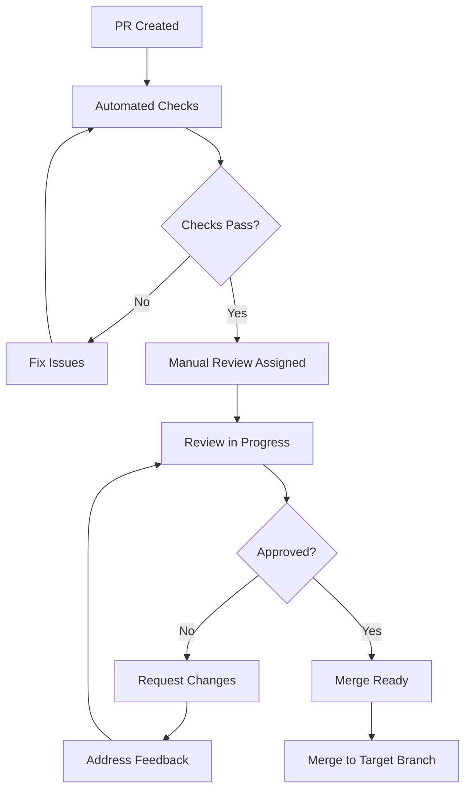

# Code Review Guidelines for Katya AI REChain Mesh

This document outlines the standards and processes for code reviews in the Katya AI REChain Mesh project. Effective code reviews ensure code quality, maintainability, and alignment with our architectural vision.

## Table of Contents

- [Overview](#overview)
- [Review Process](#review-process)
- [Review Checklist](#review-checklist)
- [Code Quality Standards](#code-quality-standards)
- [Security Review](#security-review)
- [Performance Review](#performance-review)
- [Testing Review](#testing-review)
- [Documentation Review](#documentation-review)
- [Automated Checks](#automated-checks)
- [Review Tools](#review-tools)
- [Best Practices](#best-practices)
- [Common Issues](#common-issues)

## Overview

Code reviews are mandatory for all changes to the Katya AI REChain Mesh project. They serve multiple purposes:

- **Quality Assurance**: Catch bugs and design issues early
- **Knowledge Sharing**: Spread understanding of the codebase
- **Consistency**: Ensure adherence to coding standards
- **Security**: Identify potential security vulnerabilities
- **Performance**: Review for efficiency and scalability
- **Maintainability**: Ensure code is readable and maintainable

## Review Process

### Pull Request Requirements

All pull requests must:

1. **Have a clear description** explaining the change
2. **Reference related issues** (GitHub issues, Jira tickets, etc.)
3. **Include tests** for new functionality
4. **Pass all automated checks** (CI/CD pipeline)
5. **Have appropriate labels** (bug, enhancement, documentation, etc.)

### Review Timeline

- **Initial Review**: Within 24 hours of PR creation
- **Response Time**: Reviewers should respond within 24 hours
- **Resolution**: Address review comments within 3-5 business days
- **Stale PRs**: PRs inactive for 7+ days may be closed

### Review Workflow



### Reviewer Assignment

- **Automatic Assignment**: Based on CODEOWNERS file
- **Manual Assignment**: PR author can request specific reviewers
- **Minimum Reviews**: 2 approvals required for main/develop branches
- **Domain Experts**: Security, performance, or platform-specific changes require domain experts

## Review Checklist

### General Code Review

- [ ] **Purpose**: Does the code fulfill the requirements?
- [ ] **Design**: Is the design sound and appropriate?
- [ ] **Complexity**: Is the code unnecessarily complex?
- [ ] **Readability**: Is the code easy to understand?
- [ ] **Maintainability**: Will this code be easy to maintain?
- [ ] **Performance**: Are there any obvious performance issues?
- [ ] **Security**: Are there any security concerns?
- [ ] **Testing**: Are tests adequate and appropriate?
- [ ] **Documentation**: Is documentation updated?

### Flutter/Dart Specific

- [ ] **Widget Lifecycle**: Proper state management?
- [ ] **Memory Leaks**: No unnecessary object retention?
- [ ] **Build Performance**: Efficient widget rebuilding?
- [ ] **Accessibility**: Proper semantic labels and navigation?
- [ ] **Internationalization**: All user-facing strings localized?
- [ ] **Platform Differences**: Handles platform-specific behavior?

### Go Specific

- [ ] **Error Handling**: Proper error propagation and handling?
- [ ] **Context Usage**: Appropriate use of context for cancellation?
- [ ] **Goroutines**: Safe concurrent programming?
- [ ] **Resource Management**: Proper cleanup of resources?
- [ ] **Interface Design**: Clean and appropriate interfaces?

### Cross-Language Integration

- [ ] **FFI Safety**: Safe foreign function interface usage?
- [ ] **Data Marshalling**: Proper data conversion between languages?
- [ ] **Error Propagation**: Consistent error handling across boundaries?
- [ ] **Memory Management**: No memory leaks at language boundaries?

## Code Quality Standards

### Naming Conventions

```dart
// Good: Clear, descriptive names
class MeshNetworkManager {
  final List<MeshNode> _connectedNodes;
  Stream<NetworkStatus> get networkStatus => _networkStatusController.stream;

  Future<void> discoverNearbyNodes({
    required DiscoveryConfig config,
    Duration timeout = const Duration(seconds: 30),
  }) async {
    // Implementation
  }
}

// Bad: Unclear abbreviations, poor naming
class Mgr {
  final List<Node> _nds;
  Stream<Status> get stat => _statCtrl.stream;

  Future<void> discNodes({
    required Config cfg,
    Duration t = const Duration(seconds: 30),
  }) async {
    // Implementation
  }
}
```

### Code Structure

```dart
// Good: Single responsibility, clear separation
class UserAuthenticationService {
  final AuthRepository _authRepository;
  final TokenStorage _tokenStorage;
  final BiometricAuth _biometricAuth;

  Future<AuthResult> authenticateUser(String username, String password) async {
    // Primary authentication logic
  }

  Future<bool> authenticateWithBiometrics() async {
    // Biometric authentication
  }

  Future<void> logout() async {
    // Cleanup and logout
  }
}
```

### Documentation Standards

```dart
/// Authenticates a user with the mesh network
///
/// This method performs multi-factor authentication including:
/// - Password verification
/// - Device fingerprinting
/// - Network trust validation
///
/// [username] must be a valid email address or phone number
/// [password] must meet complexity requirements
/// [rememberDevice] if true, extends session duration
///
/// Returns [AuthResult] indicating success or failure with details
/// Throws [AuthenticationException] for network or server errors
///
/// Example:
/// ```dart
/// final result = await authService.authenticateUser(
///   username: 'user@example.com',
///   password: 'securePassword123!',
///   rememberDevice: true,
/// );
///
/// if (result.isSuccessful) {
///   // Navigate to main app
/// } else {
///   // Show error message
/// }
/// ```
Future<AuthResult> authenticateUser({
  required String username,
  required String password,
  bool rememberDevice = false,
}) async {
  // Implementation with detailed comments
}
```

## Security Review

### Authentication & Authorization

- [ ] **Input Validation**: All inputs validated and sanitized?
- [ ] **Authentication Bypass**: No ways to bypass authentication?
- [ ] **Authorization Checks**: Proper permission validation?
- [ ] **Session Management**: Secure session handling?
- [ ] **Token Security**: Secure token storage and transmission?

### Data Protection

- [ ] **Encryption**: Sensitive data properly encrypted?
- [ ] **Key Management**: Secure key generation and storage?
- [ ] **Data Sanitization**: No sensitive data in logs?
- [ ] **SQL Injection**: Parameterized queries used?
- [ ] **XSS Prevention**: Output properly escaped?

### Network Security

- [ ] **HTTPS/TLS**: All network communication encrypted?
- [ ] **Certificate Pinning**: Certificate validation implemented?
- [ ] **API Keys**: No hardcoded secrets?
- [ ] **Rate Limiting**: Protection against abuse?
- [ ] **CORS**: Proper cross-origin policies?

## Performance Review

### Algorithm Complexity

- [ ] **Time Complexity**: Appropriate O(n) for use case?
- [ ] **Space Complexity**: Memory usage reasonable?
- [ ] **Scalability**: Handles expected load?
- [ ] **Bottlenecks**: No obvious performance bottlenecks?

### Resource Management

- [ ] **Memory Leaks**: All resources properly cleaned up?
- [ ] **Connection Pooling**: Database/network connections pooled?
- [ ] **Caching**: Appropriate caching strategies?
- [ ] **Lazy Loading**: Large data loaded on demand?

### Flutter Performance

- [ ] **Widget Rebuilding**: Unnecessary rebuilds minimized?
- [ ] **List Virtualization**: Large lists use virtualization?
- [ ] **Image Optimization**: Images properly sized and cached?
- [ ] **Bundle Size**: App bundle size reasonable?

## Testing Review

### Test Coverage

- [ ] **Unit Tests**: Core logic fully tested?
- [ ] **Integration Tests**: Component interactions tested?
- [ ] **End-to-End Tests**: Full user workflows tested?
- [ ] **Edge Cases**: Error conditions and edge cases covered?
- [ ] **Mock Usage**: External dependencies properly mocked?

### Test Quality

```dart
// Good: Comprehensive test with edge cases
void main() {
  group('MeshNode', () {
    late MeshNode node;

    setUp(() {
      node = MeshNode(
        id: 'test-node-123',
        address: '192.168.1.100:8080',
        capabilities: [Capability.messaging],
      );
    });

    test('should create valid node', () {
      expect(node.id, equals('test-node-123'));
      expect(node.isValid(), isTrue);
      expect(node.capabilities, contains(Capability.messaging));
    });

    test('should reject invalid addresses', () {
      expect(
        () => MeshNode(id: 'test', address: 'invalid-address'),
        throwsArgumentError,
      );
    });

    test('should handle empty capabilities', () {
      final emptyNode = MeshNode(
        id: 'test',
        address: '192.168.1.100:8080',
        capabilities: [],
      );
      expect(emptyNode.capabilities, isEmpty);
      expect(emptyNode.isValid(), isTrue);
    });

    test('should detect duplicate capabilities', () {
      final duplicateNode = MeshNode(
        id: 'test',
        address: '192.168.1.100:8080',
        capabilities: [Capability.messaging, Capability.messaging],
      );
      expect(duplicateNode.hasDuplicates(), isTrue);
    });
  });
}
```

## Documentation Review

### Code Documentation

- [ ] **API Documentation**: All public APIs documented?
- [ ] **Inline Comments**: Complex logic explained?
- [ ] **Examples**: Code examples provided where helpful?
- [ ] **Deprecation Notices**: Deprecated APIs marked?

### External Documentation

- [ ] **README Updates**: README reflects changes?
- [ ] **Changelog**: Changes documented in CHANGELOG?
- [ ] **Migration Guide**: Breaking changes documented?
- [ ] **API Reference**: API docs updated?

## Automated Checks

### CI/CD Pipeline Requirements

All PRs must pass:

```yaml
# .github/workflows/pr-checks.yml
name: PR Checks
on: [pull_request]

jobs:
  quality:
    runs-on: ubuntu-latest
    steps:
      - uses: actions/checkout@v4

      - name: Setup Flutter
        uses: subosito/flutter-action@v2

      - name: Install dependencies
        run: flutter pub get

      - name: Analyze
        run: flutter analyze --fatal-infos --fatal-warnings

      - name: Format check
        run: flutter format --set-exit-if-changed .

      - name: Test
        run: flutter test --coverage

      - name: Coverage check
        uses: codecov/codecov-action@v3
        with:
          minimum_coverage: 80
```

### Security Scanning

```yaml
# Security checks
- name: Security audit
  run: flutter pub audit

- name: Dependency check
  uses: dependency-check/Dependency-Check_Action@main

- name: CodeQL analysis
  uses: github/codeql-action/init@v2
  with:
    languages: dart
```

## Review Tools

### GitHub Review Features

- **Suggested Changes**: Propose specific code changes
- **Review Comments**: Threaded discussions on specific lines
- **Review Status**: Approve, request changes, or comment
- **Code Suggestions**: Inline code improvement suggestions

### Code Review Best Practices

```markdown
<!-- Good review comment -->
**Issue**: The error handling here could be more specific

**Suggestion**: Instead of catching all exceptions, catch specific ones:

```dart
try {
  await networkCall();
} on NetworkException catch (e) {
  // Handle network-specific errors
  _showNetworkError(e.message);
} on AuthenticationException catch (e) {
  // Handle auth errors
  _logoutUser();
} catch (e) {
  // Handle unexpected errors
  _logError(e);
  _showGenericError();
}
```

**Why**: This provides better user experience and debugging information.
```

## Best Practices

### For Reviewers

1. **Be Constructive**: Focus on code improvement, not criticism
2. **Explain Reasoning**: Provide context for suggestions
3. **Prioritize Issues**: Focus on critical issues first
4. **Be Timely**: Review within agreed timeframes
5. **Follow Up**: Check that feedback is addressed

### For Authors

1. **Prepare Well**: Ensure code is ready for review
2. **Provide Context**: Explain complex decisions
3. **Be Open**: Consider feedback thoughtfully
4. **Ask Questions**: Seek clarification when needed
5. **Learn Continuously**: Improve based on feedback

### Communication Guidelines

- **Clear Language**: Use precise, professional language
- **Actionable Feedback**: Provide specific, implementable suggestions
- **Positive Tone**: Start with positives, then improvements
- **Collaborative Spirit**: We're all working toward the same goal

## Common Issues

### Anti-Patterns to Avoid

```dart
// ❌ God Class - Single class doing too much
class UserManager {
  void authenticate() { /* ... */ }
  void sendEmail() { /* ... */ }
  void processPayment() { /* ... */ }
  void generateReports() { /* ... */ }
  void manageDatabase() { /* ... */ }
}

// ✅ Separated concerns
class AuthenticationService { /* ... */ }
class EmailService { /* ... */ }
class PaymentService { /* ... */ }
class ReportService { /* ... */ }
class DatabaseService { /* ... */ }
```

```dart
// ❌ Deep nesting
if (user != null) {
  if (user.isActive) {
    if (user.hasPermission) {
      if (network.isAvailable) {
        // Do something
      }
    }
  }
}

// ✅ Early returns
if (user == null) return;
if (!user.isActive) return;
if (!user.hasPermission) return;
if (!network.isAvailable) return;

// Do something
```

### Performance Issues

```dart
// ❌ Inefficient list operations
List<User> activeUsers = [];
for (var user in allUsers) {
  if (user.isActive) {
    activeUsers.add(user);
  }
}

// ✅ Efficient operations
List<User> activeUsers = allUsers.where((user) => user.isActive).toList();
```

### Security Issues

```dart
// ❌ SQL injection vulnerability
String query = "SELECT * FROM users WHERE name = '$name'";
database.rawQuery(query);

// ✅ Parameterized query
String query = "SELECT * FROM users WHERE name = ?";
database.query(query, [name]);
```

## Review Templates

### Pull Request Template

```markdown
## Description
[Brief description of the changes]

## Type of Change
- [ ] Bug fix
- [ ] New feature
- [ ] Breaking change
- [ ] Documentation update
- [ ] Performance improvement
- [ ] Security enhancement

## Testing
- [ ] Unit tests added/updated
- [ ] Integration tests added/updated
- [ ] Manual testing performed
- [ ] All tests pass

## Security Considerations
- [ ] Security impact assessed
- [ ] No sensitive data exposed
- [ ] Input validation implemented

## Performance Impact
- [ ] Performance impact evaluated
- [ ] No performance regressions
- [ ] Memory usage optimized

## Checklist
- [ ] Code follows style guidelines
- [ ] Documentation updated
- [ ] Commit messages conventional
- [ ] No linting errors
- [ ] Tests have good coverage
```

### Review Checklist Template

```markdown
## Code Review Checklist

### General
- [ ] Code fulfills requirements
- [ ] Design is sound
- [ ] Complexity is appropriate
- [ ] Code is readable
- [ ] Code is maintainable

### Security
- [ ] No security vulnerabilities
- [ ] Input validation implemented
- [ ] Sensitive data protected

### Performance
- [ ] No performance issues
- [ ] Resource usage optimized
- [ ] Scalability considered

### Testing
- [ ] Adequate test coverage
- [ ] Tests are meaningful
- [ ] Edge cases covered

### Documentation
- [ ] Code is documented
- [ ] README updated if needed
- [ ] API docs updated

**Review Status**: [ ] Approved | [ ] Request Changes | [ ] Comment Only
```

## Related Documentation

- [Contributing Guide](CONTRIBUTING.md)
- [Branching Strategy](BRANCHING_STRATEGY.md)
- [Testing Guide](TESTING_GUIDE.md)
- [Security Guide](SECURITY.md)
- [Architecture Guide](ARCHITECTURE.md)

---

Effective code reviews are essential for maintaining the quality and reliability of Katya AI REChain Mesh. Following these guidelines ensures consistent, high-quality code that supports our mission of decentralized AI infrastructure.
