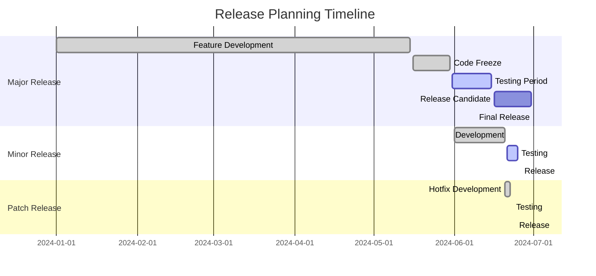

# Release Process for Katya AI REChain Mesh

This document outlines the comprehensive release process for the Katya AI REChain Mesh project, ensuring consistent, high-quality releases across all supported platforms and Git systems.

## Table of Contents

- [Overview](#overview)
- [Release Types](#release-types)
- [Version Numbering](#version-numbering)
- [Release Planning](#release-planning)
- [Pre-Release Checklist](#pre-release-checklist)
- [Release Execution](#release-execution)
- [Post-Release Activities](#post-release-activities)
- [Multi-Platform Deployment](#multi-platform-deployment)
- [Rollback Procedures](#rollback-procedures)
- [Automation](#automation)
- [Troubleshooting](#troubleshooting)

## Overview

Our release process follows a structured approach to ensure:

- **Quality Assurance**: Comprehensive testing before release
- **Consistency**: Same process across all platforms
- **Transparency**: Clear communication with stakeholders
- **Reliability**: Automated processes with manual oversight
- **Security**: Security reviews and vulnerability assessments
- **Compliance**: Adherence to regulatory requirements

## Release Types

### Major Releases (X.0.0)

- **Frequency**: 6-12 months
- **Scope**: Breaking changes, major new features
- **Process**: Extended testing period, migration guides required
- **Communication**: Advance notice to all stakeholders

### Minor Releases (X.Y.0)

- **Frequency**: 1-3 months
- **Scope**: New features, enhancements (backward compatible)
- **Process**: Standard release process
- **Communication**: Release notes and feature highlights

### Patch Releases (X.Y.Z)

- **Frequency**: As needed (weekly/monthly)
- **Scope**: Bug fixes, security patches, minor improvements
- **Process**: Expedited process for critical fixes
- **Communication**: Security advisories for security patches

### Pre-Releases

- **Alpha**: Internal testing, unstable
- **Beta**: External testing, feature-complete but may have bugs
- **Release Candidate (RC)**: Ready for production, final testing

## Version Numbering

We follow [Semantic Versioning](https://semver.org/) with additional metadata:

```
MAJOR.MINOR.PATCH[-PRERELEASE][+BUILD]

Examples:
- 2.1.0 (stable release)
- 2.1.1 (patch release)
- 3.0.0-beta.1 (pre-release)
- 2.0.5+20240101 (build metadata)
- 1.5.3+git.abc123 (development build)
```

### Version Components

- **MAJOR**: Breaking changes
- **MINOR**: New features (backward compatible)
- **PATCH**: Bug fixes (backward compatible)
- **PRERELEASE**: alpha, beta, rc with number
- **BUILD**: Build metadata (timestamps, commit hashes)

## Release Planning

### Release Cadence



### Release Planning Meeting

**Attendees**: Product Manager, Tech Lead, QA Lead, DevOps, Security Officer

**Agenda**:
1. Review upcoming features and fixes
2. Determine release type and timeline
3. Assign responsibilities
4. Identify risks and mitigation strategies
5. Set quality gates and acceptance criteria

### Risk Assessment

- **Technical Risks**: Complex integrations, performance issues
- **Business Risks**: Feature delays, stakeholder expectations
- **Security Risks**: Vulnerabilities, compliance issues
- **Operational Risks**: Deployment failures, rollback scenarios

## Pre-Release Checklist

### Code Quality Gates

- [ ] **Unit Tests**: >80% coverage, all passing
- [ ] **Integration Tests**: All passing, including cross-platform
- [ ] **End-to-End Tests**: Critical user journeys passing
- [ ] **Performance Tests**: Meet performance benchmarks
- [ ] **Security Tests**: No high/critical vulnerabilities
- [ ] **Accessibility Tests**: WCAG 2.1 AA compliance
- [ ] **Internationalization**: All supported locales tested

### Documentation Requirements

- [ ] **Changelog**: Comprehensive change log generated
- [ ] **Release Notes**: User-facing feature descriptions
- [ ] **Migration Guide**: For breaking changes (major releases)
- [ ] **API Documentation**: Updated for any API changes
- [ ] **Developer Documentation**: Updated setup/installation guides

### Legal and Compliance

- [ ] **License Compliance**: All dependencies properly licensed
- [ ] **Security Review**: Third-party security assessment
- [ ] **Privacy Impact**: Data handling reviewed
- [ ] **Regulatory Compliance**: GDPR, HIPAA, etc. as applicable
- [ ] **Export Controls**: No restricted technology exports

### Platform-Specific Checks

#### Flutter/Mobile
- [ ] iOS App Store requirements met
- [ ] Google Play Store requirements met
- [ ] Huawei AppGallery requirements met
- [ ] TestFlight beta testing completed

#### Desktop
- [ ] Windows Store certification passed
- [ ] macOS notarization completed
- [ ] Linux package validation passed

#### Web
- [ ] Cross-browser testing completed
- [ ] Performance budgets met
- [ ] SEO optimization applied

### Infrastructure Readiness

- [ ] **CI/CD Pipelines**: All platforms building successfully
- [ ] **Deployment Scripts**: Tested in staging environment
- [ ] **Monitoring**: Release monitoring configured
- [ ] **Backup Systems**: Verified and tested
- [ ] **Rollback Procedures**: Documented and tested

## Release Execution

### Release Branch Creation

```bash
# Create release branch from develop
git checkout develop
git pull origin develop
git checkout -b release/v2.1.0

# Update version numbers
echo "2.1.0" > VERSION
echo "2.1.0" > pubspec.yaml  # For Flutter
echo "2.1.0" > package.json  # For Node.js components

# Commit version changes
git add VERSION pubspec.yaml package.json
git commit -m "chore: bump version to 2.1.0"

# Push release branch
git push -u origin release/v2.1.0
```

### Build Process

```yaml
# .github/workflows/release.yml
name: Release Build
on:
  push:
    tags: ['v*.*.*']

jobs:
  build:
    runs-on: ${{ matrix.os }}
    strategy:
      matrix:
        os: [ubuntu-latest, windows-latest, macos-latest]
        include:
          - os: ubuntu-latest
            platform: linux
          - os: windows-latest
            platform: windows
          - os: macos-latest
            platform: macos

    steps:
      - uses: actions/checkout@v4

      - name: Setup Flutter
        uses: subosito/flutter-action@v2
        with:
          flutter-version: '3.16.0'

      - name: Build ${{ matrix.platform }}
        run: |
          flutter build ${{ matrix.platform }} --release
          # Additional platform-specific build steps

      - name: Upload artifacts
        uses: actions/upload-artifact@v3
        with:
          name: build-${{ matrix.platform }}
          path: build/
```

### Testing Phase

#### Automated Testing

```bash
# Run comprehensive test suite
flutter test --coverage --test-randomize-ordering-seed=random

# Integration tests
flutter test integration_test --dart-define=ENVIRONMENT=staging

# Performance tests
flutter test test/performance/ --benchmark

# Security tests
flutter pub run security_test
```

#### Manual Testing

- **Smoke Tests**: Basic functionality verification
- **Regression Tests**: Previously fixed bugs
- **User Acceptance Tests**: Stakeholder validation
- **Compatibility Tests**: Different device/OS combinations

### Staging Deployment

```bash
# Deploy to staging environment
./scripts/deploy-staging.sh

# Run staging validation tests
./scripts/validate-staging.sh

# Performance testing in staging
./scripts/performance-test-staging.sh
```

### Production Deployment

#### Multi-Platform Deployment Script

```bash
#!/bin/bash
# deploy-production.sh

set -e  # Exit on any error

VERSION=$(cat VERSION)
ENVIRONMENT="production"

echo "🚀 Starting production deployment for v$VERSION"

# Flutter Web Deployment
echo "📦 Deploying Flutter Web..."
firebase deploy --only hosting

# Mobile App Stores
echo "📱 Deploying Mobile Apps..."
./scripts/deploy-mobile.sh

# Desktop Applications
echo "💻 Deploying Desktop Apps..."
./scripts/deploy-desktop.sh

# Backend Services
echo "⚙️ Deploying Backend Services..."
./scripts/deploy-backend.sh

# Database Migrations
echo "🗄️ Running Database Migrations..."
./scripts/migrate-database.sh

# CDN Cache Invalidation
echo "🔄 Invalidating CDN Cache..."
./scripts/invalidate-cdn.sh

echo "✅ Production deployment completed successfully!"
```

#### Platform-Specific Deployments

**iOS App Store:**
```bash
# Build and submit to App Store
flutter build ios --release --no-codesign
cd ios
fastlane beta  # or fastlane release
```

**Google Play Store:**
```bash
# Build and submit to Play Store
flutter build appbundle --release
fastlane supply --aab build/app/outputs/bundle/release/app-release.aab
```

**Microsoft Store:**
```bash
# Build MSIX package
flutter build windows --release
# Submit to Microsoft Partner Center
```

### Git Tagging and Release Creation

```bash
# Create annotated tag
git tag -a v2.1.0 -m "Release v2.1.0: Enhanced AI Mesh Routing

## What's New
- AI-powered mesh network routing
- Improved blockchain integration
- Enhanced security features
- Performance optimizations

## Bug Fixes
- Fixed mesh discovery issues
- Resolved memory leaks in IoT module
- Improved error handling

## Breaking Changes
- Updated API endpoints for routing service
- Changed configuration format for AI models

See CHANGELOG.md for full details."

# Push tag to all platforms
git push origin v2.1.0
git push github v2.1.0
git push gitlab v2.1.0
# ... push to all mirror platforms
```

## Post-Release Activities

### Release Communication

#### Internal Communication

- **Team Notification**: Slack/Discord announcement
- **Status Page Update**: Update system status
- **Documentation Update**: Update internal docs

#### External Communication

- **Release Notes**: Publish on all platforms
- **Social Media**: Announce on official channels
- **User Forums**: Notify community
- **Email Newsletter**: Send to subscribers

### Monitoring and Support

#### Release Monitoring

```yaml
# Monitoring dashboard configuration
monitoring:
  alerts:
    - name: "Release Health Check"
      query: "up{version='$VERSION'}"
      threshold: 0.95
      window: 5m

    - name: "Error Rate Spike"
      query: "rate(errors_total{version='$VERSION'}[5m])"
      threshold: 0.05
      window: 5m

    - name: "Performance Degradation"
      query: "histogram_quantile(0.95, rate(request_duration_seconds{version='$VERSION'}[5m]))"
      threshold: 2.0
      window: 5m
```

#### Support Readiness

- **Support Team Briefing**: Prepare for common issues
- **Knowledge Base Update**: Add release-specific documentation
- **Hotline Setup**: Extra support capacity for first 48 hours
- **Issue Tracking**: Monitor GitHub issues and support tickets

### Metrics and Analytics

#### Release Metrics

- **Deployment Success Rate**: Percentage of successful deployments
- **Time to Deploy**: From commit to production
- **Mean Time to Recovery**: For any post-release issues
- **User Adoption Rate**: Percentage of users on new version
- **Performance Impact**: CPU, memory, network usage changes

#### Feedback Collection

- **User Surveys**: Gather user feedback
- **Crash Reports**: Monitor for new crash patterns
- **Performance Metrics**: Track real-world performance
- **Feature Usage**: Monitor adoption of new features

## Multi-Platform Deployment

### Git Platform Synchronization

```bash
# push_release.sh - Synchronize release across all platforms
#!/bin/bash

VERSION=$1
PLATFORMS=("github" "gitlab" "bitbucket" "sourcehut" "codeberg" "gitea" "gitee" "sourcecraft" "gitflic" "gitverse")

for platform in "${PLATFORMS[@]}"; do
    echo "📤 Pushing v$VERSION to $platform"
    git push $platform main
    git push $platform --tags

    # Create release on platform
    ./scripts/create-release-$platform.sh $VERSION
done

echo "✅ Release synchronized across all platforms"
```

### Platform-Specific Release Creation

**GitHub Release:**
```bash
gh release create v$VERSION \
    --title "Katya AI REChain Mesh v$VERSION" \
    --notes-file RELEASE_NOTES.md \
    --latest \
    build-artifacts/*
```

**GitLab Release:**
```bash
glab release create v$VERSION \
    --name "Katya AI REChain Mesh v$VERSION" \
    --notes-file RELEASE_NOTES.md \
    --tag v$VERSION \
    --assets build-artifacts/*
```

### Store Submissions

#### Mobile App Stores

**App Store Connect (iOS):**
```bash
# Using fastlane
fastlane deliver --submit_for_review
```

**Google Play Console:**
```bash
# Using fastlane
fastlane supply --track production
```

#### Desktop App Stores

**Microsoft Store:**
- Manual submission through Partner Center
- Automated via Microsoft Store APIs

**macOS App Store:**
```bash
# Using fastlane
fastlane deliver --submit_for_review
```

## Rollback Procedures

### Rollback Triggers

- **Critical Bugs**: Security vulnerabilities or data corruption
- **Performance Issues**: Significant performance degradation
- **Compatibility Problems**: Breaking changes affecting users
- **External Dependencies**: Third-party service outages

### Rollback Process

```bash
# rollback.sh
#!/bin/bash

TARGET_VERSION=$1  # Version to rollback to
CURRENT_VERSION=$(cat VERSION)

echo "🔄 Rolling back from v$CURRENT_VERSION to v$TARGET_VERSION"

# Update version
echo $TARGET_VERSION > VERSION

# Deploy previous version
./scripts/deploy-production.sh

# Update Git tags
git tag -d v$CURRENT_VERSION
git push origin :refs/tags/v$CURRENT_VERSION

# Notify stakeholders
./scripts/notify-rollback.sh $TARGET_VERSION

echo "✅ Rollback to v$TARGET_VERSION completed"
```

### Rollback Validation

- [ ] **Functionality Check**: Core features working
- [ ] **Data Integrity**: No data loss or corruption
- [ ] **Performance**: Acceptable performance levels
- [ ] **User Impact**: Minimal disruption to users
- [ ] **Monitoring**: Alerts and monitoring restored

## Automation

### Release Automation Tools

```yaml
# .github/workflows/automated-release.yml
name: Automated Release
on:
  workflow_dispatch:
    inputs:
      version:
        description: 'Release version (e.g., 2.1.0)'
        required: true
      type:
        description: 'Release type'
        required: true
        default: 'minor'
        options: [major, minor, patch]

jobs:
  prepare-release:
    runs-on: ubuntu-latest
    steps:
      - uses: actions/checkout@v4

      - name: Setup release environment
        run: |
          echo ${{ inputs.version }} > VERSION
          git config user.name "GitHub Actions"
          git config user.email "actions@github.com"

      - name: Update changelog
        run: ./scripts/update-changelog.sh ${{ inputs.version }}

      - name: Create release branch
        run: |
          git checkout -b release/v${{ inputs.version }}
          git add .
          git commit -m "chore: prepare release v${{ inputs.version }}"
          git push origin release/v${{ inputs.version }}

      - name: Run tests
        run: flutter test --coverage

      - name: Create pull request
        uses: peter-evans/create-pull-request@v4
        with:
          branch: release/v${{ inputs.version }}
          title: "Release v${{ inputs.version }}"
          body: "Automated release preparation for v${{ inputs.version }}"
```

### Quality Gates

```yaml
# quality-gates.yml
quality_gates:
  unit_test_coverage:
    threshold: 80
    blocking: true

  integration_test_pass_rate:
    threshold: 95
    blocking: true

  performance_regression:
    threshold: 5  # 5% degradation allowed
    blocking: true

  security_scan:
    severity_threshold: medium
    blocking: true

  accessibility_score:
    threshold: 95
    blocking: false  # Warning only
```

## Troubleshooting

### Common Release Issues

#### Build Failures

**Symptoms**: Build pipeline fails unexpectedly

**Solutions**:
```bash
# Clean build environment
flutter clean
flutter pub cache repair

# Check dependencies
flutter pub outdated
flutter pub upgrade

# Verify platform tools
flutter doctor --verbose
```

#### Test Failures

**Symptoms**: Tests passing locally but failing in CI

**Solutions**:
```bash
# Run tests with verbose output
flutter test --verbose

# Check for flaky tests
flutter test --test-randomize-ordering-seed=random --repeat=3

# Debug specific test
flutter test test/specific_test.dart --debug
```

#### Deployment Failures

**Symptoms**: Deployment succeeds but application doesn't work

**Solutions**:
```bash
# Check environment variables
env | grep -E "(API|DATABASE|REDIS)"

# Verify configuration files
cat config/production.json

# Check service health
curl -f https://api.katya-ai-rechain-mesh.com/health
```

#### Platform-Specific Issues

**iOS Issues:**
```bash
# Check provisioning profiles
fastlane match development
fastlane match appstore

# Verify code signing
security find-identity -v -p codesigning
```

**Android Issues:**
```bash
# Check keystore
keytool -list -v -keystore keystore.jks

# Verify build config
cat android/app/build.gradle
```

### Emergency Procedures

#### Emergency Hotfix

```bash
# Create hotfix branch from main
git checkout main
git pull origin main
git checkout -b hotfix/emergency-fix

# Implement fix
# Test fix
# Deploy immediately
# Create patch release
```

#### Communication Templates

**Incident Notification:**
```
🚨 URGENT: Release Issue Detected

Issue: [Brief description]
Impact: [Affected users/functionality]
Status: Investigating
ETA: [Estimated resolution time]
Workaround: [If available]

We'll provide updates as we work to resolve this.
```

**Resolution Notification:**
```
✅ Issue Resolved

The [issue] has been resolved and services are restored.
Root cause: [Brief explanation]
Prevention: [Steps taken to prevent recurrence]

Thank you for your patience.
```

## Related Documentation

- [Contributing Guide](CONTRIBUTING.md)
- [Branching Strategy](BRANCHING_STRATEGY.md)
- [Testing Guide](TESTING_GUIDE.md)
- [Git Systems Guide](GIT_SYSTEMS_GUIDE.md)
- [Monitoring Guide](MONITORING_GUIDE.md)

---

This release process ensures that Katya AI REChain Mesh maintains the highest standards of quality, security, and reliability across all platforms and deployment scenarios.
