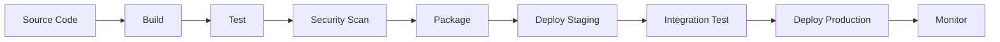

# CI/CD Best Practices for Multi-Platform Git Systems

This comprehensive guide outlines best practices for implementing Continuous Integration and Continuous Deployment (CI/CD) pipelines across multiple Git platforms using the Katya AI REChain Mesh platform.

## Table of Contents

- [Overview](#overview)
- [CI/CD Fundamentals](#cicd-fundamentals)
- [Platform-Specific CI/CD](#platform-specific-cicd)
- [Multi-Platform Pipeline Design](#multi-platform-pipeline-design)
- [Testing Strategies](#testing-strategies)
- [Deployment Strategies](#deployment-strategies)
- [Security in CI/CD](#security-in-cicd)
- [Monitoring and Observability](#monitoring-and-observability)
- [Performance Optimization](#performance-optimization)
- [Troubleshooting](#troubleshooting)
- [Case Studies](#case-studies)

## Overview

Effective CI/CD practices in multi-platform Git environments require careful consideration of platform differences, synchronization challenges, and cross-platform compatibility. This guide provides proven strategies for implementing robust CI/CD pipelines with Katya AI REChain Mesh.

### Key Challenges

- **Platform Differences**: Varying CI/CD capabilities across Git platforms
- **Synchronization**: Ensuring consistent code across platforms during deployment
- **Security**: Maintaining security across multiple platforms
- **Complexity**: Managing pipelines across distributed teams
- **Performance**: Optimizing for speed and reliability

### Core Principles

1. **Consistency**: Same code quality and deployment standards across platforms
2. **Automation**: Maximize automation while maintaining control
3. **Security**: Implement security at every stage of the pipeline
4. **Observability**: Comprehensive monitoring and logging
5. **Scalability**: Design for growth and changing requirements

## CI/CD Fundamentals

### Pipeline Stages



#### 1. Source Stage
- **Trigger**: Code changes, scheduled builds, manual triggers
- **Actions**: Code checkout, dependency installation, environment setup

#### 2. Build Stage
- **Compilation**: Build artifacts for different platforms
- **Dependencies**: Resolve and cache dependencies
- **Validation**: Basic syntax and import checks

#### 3. Test Stage
- **Unit Tests**: Fast, isolated component tests
- **Integration Tests**: Test component interactions
- **End-to-End Tests**: Full application workflow tests

#### 4. Security Stage
- **SAST**: Static Application Security Testing
- **SCA**: Software Composition Analysis
- **Container Scanning**: Image vulnerability scanning

#### 5. Package Stage
- **Artifact Creation**: Build deployable packages
- **Container Images**: Create optimized container images
- **Metadata**: Attach version information and changelogs

#### 6. Deploy Stage
- **Staging**: Deploy to test environments
- **Production**: Controlled production deployment
- **Rollback**: Automated rollback capabilities

### Pipeline Configuration

#### GitHub Actions

```yaml
# .github/workflows/ci-cd.yml
name: CI/CD Pipeline

on:
  push:
    branches: [ main, develop ]
  pull_request:
    branches: [ main ]

jobs:
  test:
    runs-on: ubuntu-latest
    steps:
      - uses: actions/checkout@v3
      - name: Setup Go
        uses: actions/setup-go@v3
        with:
          go-version: '1.19'
      - name: Cache dependencies
        uses: actions/cache@v3
        with:
          path: ~/go/pkg/mod
          key: ${{ runner.os }}-go-${{ hashFiles('**/go.sum') }}
      - name: Run tests
        run: go test ./...
      - name: Upload coverage
        uses: codecov/codecov-action@v3

  security:
    runs-on: ubuntu-latest
    steps:
      - uses: actions/checkout@v3
      - name: Run SAST
        uses: github/super-linter@v4
      - name: Dependency check
        uses: dependency-check/Dependency-Check_Action@main

  build:
    needs: [test, security]
    runs-on: ubuntu-latest
    steps:
      - uses: actions/checkout@v3
      - name: Build binary
        run: go build -o katya-mesh ./cmd/server
      - name: Build Docker image
        run: docker build -t katya-mesh:${{ github.sha }} .
      - name: Push to registry
        run: docker push katya-mesh:${{ github.sha }}

  deploy-staging:
    needs: build
    runs-on: ubuntu-latest
    environment: staging
    steps:
      - name: Deploy to staging
        run: kubectl set image deployment/katya-mesh katya-mesh=katya-mesh:${{ github.sha }}

  deploy-production:
    needs: deploy-staging
    runs-on: ubuntu-latest
    environment: production
    steps:
      - name: Deploy to production
        run: kubectl set image deployment/katya-mesh katya-mesh=katya-mesh:${{ github.sha }}
```

#### GitLab CI/CD

```yaml
# .gitlab-ci.yml
stages:
  - test
  - security
  - build
  - deploy

variables:
  DOCKER_IMAGE: $CI_REGISTRY_IMAGE:$CI_COMMIT_SHA

test:
  stage: test
  image: golang:1.19
  cache:
    key: ${CI_COMMIT_REF_SLUG}
    paths:
      - go/pkg/mod/
  script:
    - go test ./... -coverprofile=coverage.out
    - go tool cover -html=coverage.out -o coverage.html
  artifacts:
    reports:
      coverage_report:
        coverage_format: cobertura
        path: coverage.out
    paths:
      - coverage.html
  only:
    - merge_requests
    - main

security:
  stage: security
  image: zricethezav/gitleaks:latest
  script:
    - gitleaks detect --verbose --redact --config .gitleaks.toml
  artifacts:
    reports:
      sast: gl-sast-report.json
  only:
    - merge_requests
    - main

build:
  stage: build
  image: docker:latest
  services:
    - docker:dind
  script:
    - docker login -u $CI_REGISTRY_USER -p $CI_REGISTRY_PASSWORD $CI_REGISTRY
    - docker build -t $DOCKER_IMAGE .
    - docker push $DOCKER_IMAGE
  only:
    - main

deploy_staging:
  stage: deploy
  script:
    - kubectl set image deployment/katya-mesh katya-mesh=$DOCKER_IMAGE
  environment:
    name: staging
    url: https://staging.katya-ai-rechain-mesh.com
  only:
    - main

deploy_production:
  stage: deploy
  script:
    - kubectl set image deployment/katya-mesh katya-mesh=$DOCKER_IMAGE
  environment:
    name: production
    url: https://katya-ai-rechain-mesh.com
  when: manual
  only:
    - main
```

## Platform-Specific CI/CD

### GitHub Actions Best Practices

#### Workflow Optimization

```yaml
# Optimized GitHub Actions workflow
name: Optimized CI/CD

on:
  push:
    branches: [ main ]
  pull_request:
    branches: [ main ]

# Use concurrency to cancel previous runs
concurrency:
  group: ${{ github.workflow }}-${{ github.ref }}
  cancel-in-progress: true

jobs:
  test:
    runs-on: ubuntu-latest
    strategy:
      matrix:
        go-version: [1.18, 1.19, 1.20]
    steps:
      - uses: actions/checkout@v3

      # Use composite actions for reusability
      - uses: ./.github/actions/setup-go
        with:
          go-version: ${{ matrix.go-version }}

      - name: Run tests
        run: go test ./... -race -coverprofile=coverage.out

      - name: Upload coverage
        uses: codecov/codecov-action@v3
        with:
          file: ./coverage.out

  # Use job outputs to control deployment
  build:
    needs: test
    runs-on: ubuntu-latest
    outputs:
      image: ${{ steps.build.outputs.image }}
    steps:
      - uses: actions/checkout@v3
      - name: Build and push
        id: build
        run: |
          IMAGE=katya-mesh:${{ github.sha }}
          docker build -t $IMAGE .
          docker push $IMAGE
          echo "image=$IMAGE" >> $GITHUB_OUTPUT

  deploy:
    needs: build
    runs-on: ubuntu-latest
    environment: production
    steps:
      - name: Deploy
        run: kubectl set image deployment/katya-mesh katya-mesh=${{ needs.build.outputs.image }}
```

### GitLab CI/CD Best Practices

#### Advanced Pipeline Features

```yaml
# Advanced GitLab CI/CD configuration
stages:
  - validate
  - test
  - build
  - review
  - deploy

variables:
  DOCKER_IMAGE: $CI_REGISTRY_IMAGE:$CI_COMMIT_REF_SLUG-$CI_COMMIT_SHORT_SHA

# Use rules for conditional execution
workflow:
  rules:
    - if: $CI_COMMIT_BRANCH == "main"
    - if: $CI_MERGE_REQUEST_TARGET_BRANCH_NAME == "main"

validate:
  stage: validate
  script:
    - echo "Validating commit messages..."
    - ./scripts/validate-commit.sh
  only:
    - merge_requests

test:
  stage: test
  parallel:
    matrix:
      - GO_VERSION: ["1.18", "1.19", "1.20"]
  image: golang:${GO_VERSION}
  cache:
    key: ${CI_COMMIT_REF_SLUG}-go-${GO_VERSION}
    paths:
      - go/pkg/mod/
  script:
    - go test ./... -race -coverprofile=coverage.out
  artifacts:
    reports:
      coverage_report:
        coverage_format: cobertura
        path: coverage.out
    expire_in: 1 week

# Use environments for deployment management
deploy_review:
  stage: review
  script:
    - ./scripts/deploy-review.sh
  environment:
    name: review/$CI_COMMIT_REF_NAME
    url: https://$CI_COMMIT_REF_SLUG.katya-ai-rechain-mesh.com
    on_stop: stop_review
    auto_stop_in: 1 week
  only:
    - merge_requests

stop_review:
  stage: review
  script:
    - ./scripts/stop-review.sh
  environment:
    name: review/$CI_COMMIT_REF_NAME
    action: stop
  when: manual
  only:
    - merge_requests

deploy_staging:
  stage: deploy
  script:
    - ./scripts/deploy.sh staging
  environment:
    name: staging
    url: https://staging.katya-ai-rechain-mesh.com
  only:
    - main

deploy_production:
  stage: deploy
  script:
    - ./scripts/deploy.sh production
  environment:
    name: production
    url: https://katya-ai-rechain-mesh.com
  when: manual
  only:
    - main
```

### Bitbucket Pipelines

```yaml
# bitbucket-pipelines.yml
image: golang:1.19

pipelines:
  default:
    - step:
        name: Test
        caches:
          - golang
        script:
          - go test ./... -v
        artifacts:
          - coverage.out

  branches:
    main:
      - step:
          name: Build and Test
          caches:
            - golang
            - docker
          script:
            - go test ./... -race
            - go build -o katya-mesh ./cmd/server
            - docker build -t katya-mesh .
          artifacts:
            - katya-mesh

      - step:
          name: Deploy to Staging
          deployment: staging
          script:
            - pipe: atlassian/kubectl-run:1.1.0
              variables:
                KUBECONFIG: $KUBECONFIG
                RESOURCE_PATH: deployment/katya-mesh
                COMMAND: set
                ARGS: image=katya-mesh=katya-mesh:latest

      - step:
          name: Deploy to Production
          deployment: production
          trigger: manual
          script:
            - pipe: atlassian/kubectl-run:1.1.1
              variables:
                KUBECONFIG: $KUBECONFIG
                RESOURCE_PATH: deployment/katya-mesh
                COMMAND: set
                ARGS: image=katya-mesh=katya-mesh:latest
```

## Multi-Platform Pipeline Design

### Unified Pipeline Configuration

#### Cross-Platform Pipeline Definition

```yaml
# katya-cicd.yml - Unified pipeline configuration
version: '1.0'

global:
  environment:
    GO_VERSION: '1.19'
    NODE_VERSION: '18'
  cache:
    - go-mod
    - node-modules

pipelines:
  pull_request:
    - name: validate
      platforms: [github, gitlab, bitbucket]
      steps:
        - name: lint
          run: golangci-lint run
        - name: test
          run: go test ./...
          artifacts:
            - coverage.out

  main_branch:
    - name: build
      platforms: [github, gitlab, bitbucket]
      steps:
        - name: build
          run: |
            go build -o katya-mesh ./cmd/server
            docker build -t katya-mesh:$GIT_SHA .
        - name: security_scan
          run: |
            trivy image katya-mesh:$GIT_SHA
            dependency-check --scan .

    - name: deploy_staging
      platforms: [github, gitlab]
      environment: staging
      steps:
        - name: deploy
          run: kubectl set image deployment/katya-mesh katya-mesh=katya-mesh:$GIT_SHA

    - name: deploy_production
      platforms: [github, gitlab]
      environment: production
      manual: true
      steps:
        - name: deploy
          run: kubectl set image deployment/katya-mesh katya-mesh=katya-mesh:$GIT_SHA
```

### Platform Abstraction Layer

```python
# Platform abstraction for unified CI/CD
class CICDPipeline:
    def __init__(self, platform):
        self.platform = platform
        self.steps = []

    def add_step(self, name, config):
        # Adapt step configuration for specific platform
        adapted_config = self.adapt_step_for_platform(name, config)
        self.steps.append(adapted_config)

    def adapt_step_for_platform(self, name, config):
        if self.platform == 'github':
            return self.to_github_actions(name, config)
        elif self.platform == 'gitlab':
            return self.to_gitlab_ci(name, config)
        elif self.platform == 'bitbucket':
            return self.to_bitbucket_pipelines(name, config)

    def to_github_actions(self, name, config):
        return {
            'name': name,
            'run': config.get('run', ''),
            'uses': config.get('action', ''),
            'with': config.get('params', {})
        }

    def to_gitlab_ci(self, name, config):
        return {
            'stage': config.get('stage', 'test'),
            'script': config.get('run', '').split('\n'),
            'image': config.get('image', 'alpine:latest')
        }

    def generate_config(self):
        if self.platform == 'github':
            return self.generate_github_workflow()
        elif self.platform == 'gitlab':
            return self.generate_gitlab_ci()
        elif self.platform == 'bitbucket':
            return self.generate_bitbucket_pipelines()
```

### Synchronization in Multi-Platform Pipelines

```yaml
# Multi-platform synchronization
sync_pipeline:
  name: "Cross-Platform Sync"
  triggers:
    - platform: github
      events: [push]
    - platform: gitlab
      events: [push]
    - platform: bitbucket
      events: [push]

  steps:
    - name: "Wait for all platforms"
      action: "wait_for_sync"
      timeout: "10m"
      platforms: ["github", "gitlab", "bitbucket"]

    - name: "Unified testing"
      action: "run_tests"
      parallel: true
      platforms: ["github", "gitlab", "bitbucket"]

    - name: "Synchronized deployment"
      action: "deploy"
      requires: ["testing_complete"]
      platforms: ["github", "gitlab"]  # Only deploy from primary platforms
```

## Testing Strategies

### Test Automation Pyramid


### Multi-Platform Testing

#### Cross-Platform Compatibility Tests

```python
# Cross-platform compatibility testing
import pytest
from katya_mesh.testing import PlatformTestSuite

class TestCrossPlatformCompatibility:
    @pytest.mark.parametrize("platform", ["github", "gitlab", "bitbucket"])
    def test_api_compatibility(self, platform):
        """Test API responses are consistent across platforms"""
        client = PlatformTestSuite.get_client(platform)
        response = client.get("/api/v1/repositories")

        assert response.status_code == 200
        assert "repositories" in response.json()

    @pytest.mark.parametrize("platform", ["github", "gitlab", "bitbucket"])
    def test_webhook_delivery(self, platform):
        """Test webhook delivery works on all platforms"""
        webhook_server = PlatformTestSuite.create_webhook_server()

        # Trigger webhook on platform
        PlatformTestSuite.trigger_webhook(platform, "push", webhook_server.url)

        # Verify webhook was received
        assert webhook_server.wait_for_webhook(timeout=30)

    @pytest.mark.parametrize("platform", ["github", "gitlab", "bitbucket"])
    def test_repository_sync(self, platform):
        """Test repository synchronization works correctly"""
        # Create test repository
        repo = PlatformTestSuite.create_test_repo(platform)

        # Make changes
        PlatformTestSuite.commit_changes(repo, "test change")

        # Wait for sync
        PlatformTestSuite.wait_for_sync(repo, timeout=300)

        # Verify sync completed
        assert PlatformTestSuite.verify_sync(repo)
```

### Performance Testing in CI/CD

```yaml
# Performance testing in CI/CD
performance_tests:
  - name: "Load Testing"
    stage: test
    script:
      - echo "Running load tests..."
      - k6 run --vus 10 --duration 30s load_test.js
    artifacts:
      reports:
        performance: k6-results.json

  - name: "API Performance"
    stage: test
    script:
      - echo "Testing API performance..."
      - artillery run artillery.yml
    artifacts:
      reports:
        performance: artillery-report.json

  - name: "Database Performance"
    stage: test
    script:
      - echo "Testing database performance..."
      - pgbench -c 10 -T 60 katya_mesh
    artifacts:
      paths:
        - pgbench_results.txt
```

## Deployment Strategies

### Blue-Green Deployment

```yaml
# Blue-green deployment strategy
blue_green_deployment:
  environments:
    blue:
      url: https://blue.katya-ai-rechain-mesh.com
      version: "v1.2.3"
      traffic: 100%

    green:
      url: https://green.katya-ai-rechain-mesh.com
      version: "v1.3.0"
      traffic: 0%

  deployment:
    - name: "Deploy to Green"
      script: |
        kubectl set image deployment/katya-mesh-green katya-mesh=katya-mesh:v1.3.0
        kubectl wait --for=condition=available --timeout=300s deployment/katya-mesh-green

    - name: "Health Check"
      script: |
        curl -f https://green.katya-ai-rechain-mesh.com/health

    - name: "Switch Traffic"
      script: |
        # Update ingress to route traffic to green
        kubectl patch ingress katya-mesh -p '{"spec":{"rules":[{"host":"katya-ai-rechain-mesh.com","http":{"paths":[{"path":"/","pathType":"Prefix","backend":{"service":{"name":"katya-mesh-green","port":{"number":80}}}}]}}]}}'

    - name: "Monitor"
      script: |
        # Monitor for 10 minutes
        sleep 600
        # Check error rates and performance

    - name: "Full Traffic Switch"
      script: |
        # If monitoring passes, switch all traffic
        kubectl patch ingress katya-mesh -p '{"spec":{"rules":[{"host":"katya-ai-rechain-mesh.com","http":{"paths":[{"path":"/","pathType":"Prefix","backend":{"service":{"name":"katya-mesh-green","port":{"number":80}}}}]}}]}}'
        kubectl scale deployment katya-mesh-blue --replicas=0
```

### Canary Deployment

```yaml
# Canary deployment strategy
canary_deployment:
  steps:
    - name: "Deploy Canary"
      script: |
        # Deploy new version to 5% of traffic
        kubectl apply -f k8s/canary-deployment.yml
        kubectl set image deployment/katya-mesh-canary katya-mesh=katya-mesh:v1.3.0

    - name: "Canary Analysis"
      script: |
        # Monitor canary for 30 minutes
        sleep 1800

        # Check metrics
        ERROR_RATE=$(kubectl get hpa katya-mesh-canary -o jsonpath='{.status.currentMetrics[0].resource.current.averageUtilization}')
        LATENCY=$(kubectl get hpa katya-mesh-canary -o jsonpath='{.status.currentMetrics[1].resource.current.averageUtilization}')

        if [ "$ERROR_RATE" -gt 5 ] || [ "$LATENCY" -gt 200 ]; then
          echo "Canary failed, rolling back..."
          kubectl delete deployment katya-mesh-canary
          exit 1
        fi

    - name: "Gradual Rollout"
      script: |
        # Gradually increase traffic to canary
        for percentage in 10 25 50 75 100; do
          kubectl patch ingress katya-mesh -p "{\"spec\":{\"rules\":[{\"host\":\"katya-ai-rechain-mesh.com\",\"http\":{\"paths\":[{\"path\":\"/\",\"pathType\":\"Prefix\",\"backend\":{\"service\":{\"name\":\"katya-mesh-canary\",\"port\":{\"number\":80}}}},{\"path\":\"/\",\"pathType\":\"Prefix\",\"backend\":{\"service\":{\"name\":\"katya-mesh-stable\",\"port\":{\"number\":80}}}}]}}]}}"
          sleep 300  # Monitor for 5 minutes
        done

    - name: "Complete Rollout"
      script: |
        # Switch all traffic to new version
        kubectl set image deployment/katya-mesh-stable katya-mesh=katya-mesh:v1.3.0
        kubectl delete deployment katya-mesh-canary
```

### Rolling Deployment

```yaml
# Rolling deployment strategy
rolling_deployment:
  strategy:
    type: RollingUpdate
    rollingUpdate:
      maxUnavailable: 25%
      maxSurge: 25%

  steps:
    - name: "Update Deployment"
      script: |
        kubectl set image deployment/katya-mesh katya-mesh=katya-mesh:v1.3.0

    - name: "Monitor Rollout"
      script: |
        kubectl rollout status deployment/katya-mesh --timeout=600s

    - name: "Verify Deployment"
      script: |
        # Check pod health
        kubectl get pods -l app=katya-mesh

        # Run smoke tests
        ./scripts/smoke-test.sh

    - name: "Rollback on Failure"
      script: |
        if [ $? -ne 0 ]; then
          echo "Deployment failed, rolling back..."
          kubectl rollout undo deployment/katya-mesh
        fi
```

## Security in CI/CD

### Secret Management

#### Secure Secret Storage

```yaml
# GitHub Actions secrets
secrets:
  DOCKER_REGISTRY_PASSWORD:
    description: "Docker registry password"
    required: true

  KUBECONFIG:
    description: "Kubernetes configuration"
    required: true

  DATABASE_URL:
    description: "Database connection string"
    required: true

# GitLab CI/CD secrets
variables:
  DOCKER_REGISTRY_PASSWORD:
    value: $DOCKER_REGISTRY_PASSWORD
    masked: true

  KUBECONFIG:
    value: $KUBECONFIG
    masked: true
    protected: true

  DATABASE_URL:
    value: $DATABASE_URL
    masked: true
    protected: true
```

#### Runtime Secret Injection

```yaml
# Secure secret injection
secret_injection:
  - name: "Database Credentials"
    source: "vault"
    path: "secret/database"
    inject_as:
      - env: DATABASE_PASSWORD
      - file: /secrets/db_password

  - name: "API Keys"
    source: "aws-secretsmanager"
    secret_id: "katya/api-keys"
    inject_as:
      - env: GITHUB_TOKEN
      - env: GITLAB_TOKEN
```

### Security Scanning Integration

```yaml
# Comprehensive security scanning
security_scanning:
  sast:
    - name: "Static Analysis"
      tools: [sonarcloud, semgrep, codeql]
      config:
        severity_threshold: high
        fail_on_findings: true

  dependency_scanning:
    - name: "Dependency Check"
      tools: [owasp-dependency-check, trivy]
      config:
        fail_on_critical: true
        ignore_unfixed: false

  container_scanning:
    - name: "Container Security"
      tools: [trivy, clair, anchore]
      config:
        severity_threshold: medium
        fail_on_findings: true

  secret_detection:
    - name: "Secret Detection"
      tools: [gitleaks, trufflehog]
      config:
        entropy_threshold: 3.5
        fail_on_findings: true
```

### Access Control

```yaml
# CI/CD access control
access_control:
  branch_protection:
    - branch: main
      required_checks:
        - test
        - security_scan
        - code_review
      restrictions:
        enforce_admins: false
        required_pull_request_reviews: true
        required_status_checks: true

  environment_protection:
    - environment: production
      reviewers:
        - team_leads
        - security_team
      deployment_branch_policy:
        protected_branches: true
        custom_branch_policies: false

  secret_access:
    - level: repository
      secrets: [DOCKER_REGISTRY_PASSWORD]
    - level: environment
      environment: production
      secrets: [KUBECONFIG, DATABASE_URL]
```

## Monitoring and Observability

### Pipeline Monitoring

```yaml
# Pipeline monitoring configuration
pipeline_monitoring:
  metrics:
    - name: pipeline_duration
      type: histogram
      labels: [pipeline, stage, status]

    - name: pipeline_success_rate
      type: gauge
      labels: [pipeline, branch]

    - name: deployment_frequency
      type: counter
      labels: [environment]

    - name: deployment_lead_time
      type: histogram
      labels: [environment]

  alerts:
    - name: PipelineFailure
      condition: rate(pipeline_failures[5m]) > 0
      severity: critical
      channels: [slack, email]

    - name: SlowPipeline
      condition: histogram_quantile(0.95, rate(pipeline_duration_bucket[5m])) > 1800
      severity: warning
      channels: [slack]

    - name: DeploymentFailure
      condition: rate(deployment_failures[5m]) > 0
      severity: critical
      channels: [slack, pager]
```

### Log Aggregation

```yaml
# Centralized logging configuration
logging:
  collection:
    - source: github_actions
      format: json
      fields:
        - workflow
        - job
        - step
        - status
        - duration

    - source: gitlab_ci
      format: json
      fields:
        - pipeline_id
        - job_id
        - stage
        - status
        - duration

    - source: application
      format: json
      fields:
        - level
        - message
        - service
        - request_id

  aggregation:
    tool: elasticsearch
    index_pattern: "cicd-logs-%{+YYYY.MM.dd}"

  visualization:
    tool: kibana
    dashboards:
      - pipeline-overview
      - deployment-analytics
      - error-analysis
```

### Performance Metrics

```yaml
# CI/CD performance metrics
performance_metrics:
  dora_metrics:
    - name: deployment_frequency
      query: |
        sum(rate(deployment_total[7d])) / 7
      unit: deployments/day

    - name: lead_time_for_changes
      query: |
        histogram_quantile(0.95, rate(lead_time_bucket[7d]))
      unit: hours

    - name: change_failure_rate
      query: |
        rate(failed_deployments_total[7d]) / rate(deployment_total[7d]) * 100
      unit: percentage

    - name: time_to_restore
      query: |
        histogram_quantile(0.95, rate(incident_resolution_time_bucket[30d]))
      unit: hours

  custom_metrics:
    - name: pipeline_queue_time
      query: |
        histogram_quantile(0.95, rate(pipeline_queue_duration_bucket[1d]))
      unit: seconds

    - name: test_execution_time
      query: |
        histogram_quantile(0.95, rate(test_duration_bucket[1d]))
      unit: seconds

    - name: build_success_rate
      query: |
        rate(successful_builds_total[1d]) / rate(total_builds_total[1d]) * 100
      unit: percentage
```

## Performance Optimization

### Pipeline Optimization Techniques

#### Parallel Execution

```yaml
# Parallel pipeline execution
parallel_pipeline:
  jobs:
    test:
      parallel:
        matrix:
          - go: [1.18, 1.19, 1.20]
          - os: [ubuntu-latest, windows-latest]
      steps:
        - name: Setup Go ${{ matrix.go }}
          uses: actions/setup-go@v3
          with:
            go-version: ${{ matrix.go }}

        - name: Run tests
          run: go test ./...

    build:
      needs: test
      strategy:
        matrix:
          include:
            - target: linux-amd64
              runs-on: ubuntu-latest
            - target: windows-amd64
              runs-on: windows-latest
            - target: darwin-amd64
              runs-on: macos-latest
      steps:
        - name: Build
          run: ./scripts/build.sh ${{ matrix.target }}
```

#### Caching Strategies

```yaml
# Comprehensive caching strategy
caching:
  dependencies:
    - language: go
      cache:
        - path: ~/go/pkg/mod
          key: go-mod-${{ hashFiles('go.sum') }}
          restore-keys: |
            go-mod-

    - language: node
      cache:
        - path: ~/.npm
          key: npm-${{ hashFiles('package-lock.json') }}
          restore-keys: |
            npm-

    - language: python
      cache:
        - path: ~/.cache/pip
          key: pip-${{ hashFiles('requirements.txt') }}
          restore-keys: |
            pip-

  build_artifacts:
    - path: dist/
      key: build-${{ github.sha }}
      retention: 7 days

  docker_layers:
    - path: /tmp/.buildx-cache
      key: docker-${{ runner.os }}-${{ github.sha }}
      restore-keys: |
        docker-${{ runner.os }}-
```

#### Resource Optimization

```yaml
# Resource optimization
resource_optimization:
  job_sizing:
    small:
      runs-on: ubuntu-latest
      cpu: 2
      memory: 4GB

    medium:
      runs-on: ubuntu-latest
      cpu: 4
      memory: 8GB

    large:
      runs-on: ubuntu-latest-16-cores
      cpu: 16
      memory: 32GB

  spot_instances:
    - name: "Use spot instances for non-critical jobs"
      runs-on: ubuntu-latest-spot
      continue-on-error: true

  self_hosted:
    - name: "Use self-hosted runners for specialized workloads"
      runs-on: [self-hosted, gpu]
      if: contains(github.event.head_commit.message, '[gpu]')
```

### Bottleneck Identification

```bash
# Pipeline bottleneck analysis
#!/bin/bash
# analyze_pipeline_bottlenecks.sh

echo "🔍 Analyzing pipeline bottlenecks..."

# Get pipeline execution data
PIPELINE_DATA=$(gh api repos/$REPO/actions/runs --jq '.workflow_runs[] | {id, name, status, created_at, updated_at}')

echo "$PIPELINE_DATA" | jq -r '
  . as $run |
  ($run.updated_at | strptime("%Y-%m-%dT%H:%M:%SZ") | mktime) -
  ($run.created_at | strptime("%Y-%m-%dT%H:%M:%SZ") | mktime) as $duration |
  [$run.name, $duration] |
  @csv
' > pipeline_durations.csv

# Analyze slowest jobs
echo "Top 10 slowest jobs:"
sort -t, -k2 -nr pipeline_durations.csv | head -10

# Identify bottleneck patterns
echo "Bottleneck analysis:"
echo "Jobs taking longer than 30 minutes:"
awk -F, '$2 > 1800 {print $0}' pipeline_durations.csv

echo "✅ Analysis complete"
```

## Troubleshooting

### Common Pipeline Issues

#### Build Failures

**Issue**: Dependencies not found

**Solutions**:
```yaml
# Fix dependency caching
- name: Cache dependencies
  uses: actions/cache@v3
  with:
    path: |
      ~/.npm
      ~/.cache/pip
    key: ${{ runner.os }}-${{ hashFiles('package-lock.json', 'requirements.txt') }}

- name: Install dependencies
  run: |
    npm ci
    pip install -r requirements.txt
```

**Issue**: Build timeout

**Solutions**:
```yaml
# Increase timeout and optimize build
jobs:
  build:
    runs-on: ubuntu-latest
    timeout-minutes: 60
    steps:
      - name: Build with optimizations
        run: |
          make build-optimized
```

#### Test Failures

**Issue**: Flaky tests

**Solutions**:
```yaml
# Retry flaky tests
- name: Run tests with retry
  uses: nick-invision/retry@v2
  with:
    timeout_minutes: 10
    max_attempts: 3
    command: npm test
```

**Issue**: Test environment issues

**Solutions**:
```yaml
# Use consistent test environment
- name: Setup test environment
  run: |
    docker-compose up -d db redis
    ./scripts/wait-for-services.sh
    npm run db:migrate
```

#### Deployment Issues

**Issue**: Deployment timeout

**Solutions**:
```yaml
# Add deployment health checks
- name: Wait for deployment
  run: |
    kubectl wait --for=condition=available --timeout=300s deployment/my-app
    curl -f --retry 10 --retry-connrefused http://localhost/health
```

**Issue**: Rollback failures

**Solutions**:
```yaml
# Implement robust rollback
- name: Rollback on failure
  if: failure()
  run: |
    kubectl rollout undo deployment/my-app
    kubectl wait --for=condition=available deployment/my-app
```

### Debugging Techniques

#### Pipeline Debugging

```bash
# Debug pipeline execution
gh workflow run debug-pipeline.yml \
  -f debug_mode=true \
  -f verbose_logging=true

# View detailed logs
gh run view <run-id> --log

# SSH into runner (GitHub Actions)
- name: Setup tmate session
  if: ${{ github.event_name == 'workflow_dispatch' && github.event.inputs.debug_enabled == 'true' }}
  uses: mxschmitt/action-tmate@v3
```

#### Log Analysis

```bash
# Analyze pipeline logs
gh api repos/$REPO/actions/runs/$RUN_ID/logs > logs.zip
unzip logs.zip

# Search for errors
grep -r "ERROR" logs/
grep -r "FAILED" logs/

# Analyze timing
find logs/ -name "*.txt" -exec grep "took" {} \; | sort -k2 -n
```

## Case Studies

### Enterprise Migration Case Study

#### Challenge
A large enterprise with 500+ repositories across GitHub Enterprise and GitLab needed to standardize their CI/CD processes while maintaining platform-specific workflows.

#### Solution
```yaml
# Unified pipeline template
unified_pipeline:
  templates:
    - name: "standard-build"
      platforms: [github, gitlab]
      steps:
        - checkout
        - setup_runtime
        - cache_dependencies
        - lint
        - test
        - build
        - security_scan

    - name: "platform-specific"
      github:
        - name: "GitHub-specific step"
          uses: actions/some-action@v1
      gitlab:
        - name: "GitLab-specific step"
          script: ./gitlab-specific.sh

  repositories:
    - name: "web-frontend"
      template: standard-build
      overrides:
        test_command: "npm run test:ci"
        build_command: "npm run build"

    - name: "api-backend"
      template: standard-build
      overrides:
        test_command: "go test ./..."
        build_command: "go build ./cmd/api"
```

#### Results
- **Standardization**: 80% reduction in pipeline configuration duplication
- **Efficiency**: 40% faster pipeline execution through optimization
- **
