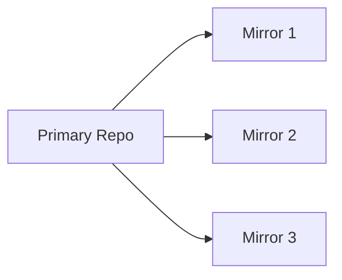
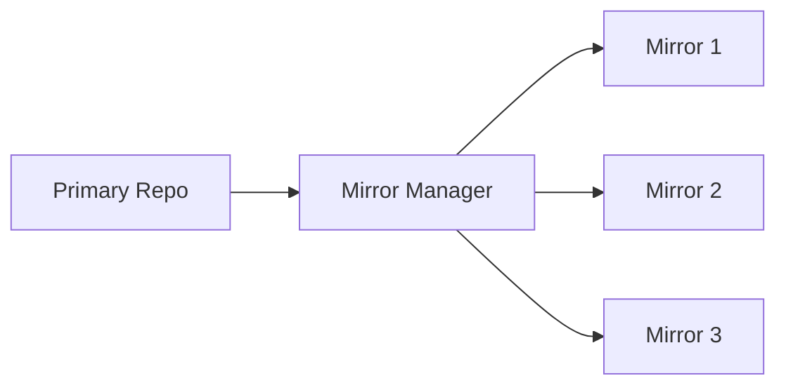
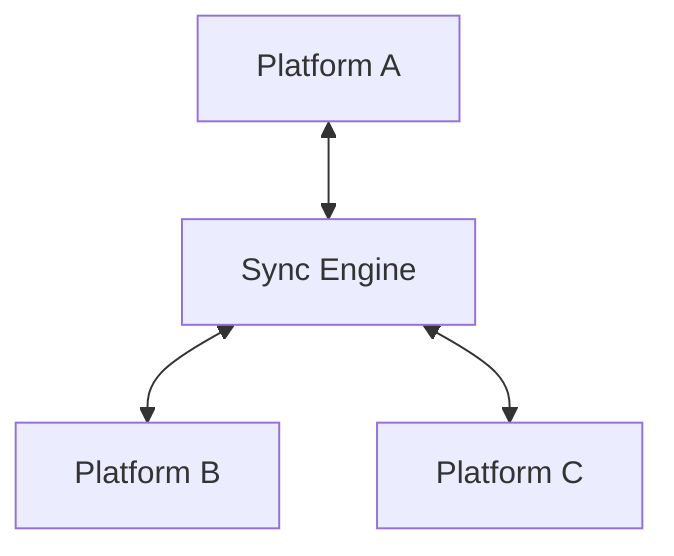
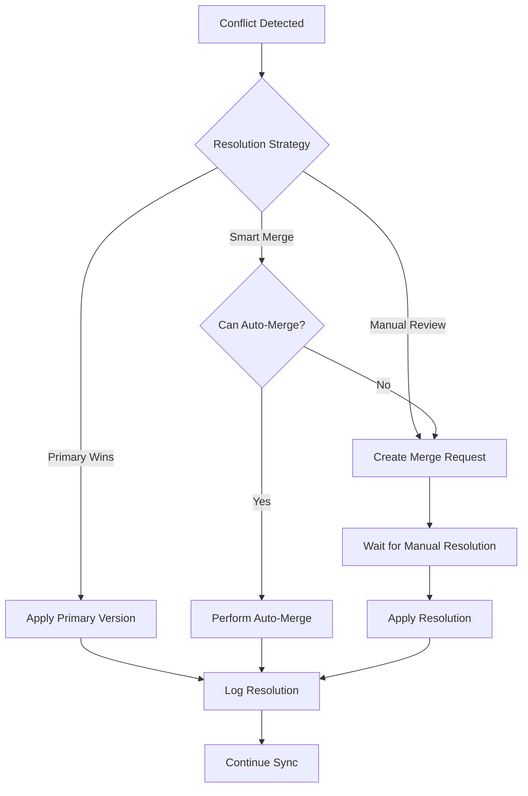

# Mirror Management Guide for Katya AI REChain Mesh

This comprehensive guide covers the management of repository mirrors across multiple Git platforms, including setup, synchronization, monitoring, and troubleshooting strategies for the Katya AI REChain Mesh platform.

## Table of Contents

- [Overview](#overview)
- [Mirror Concepts](#mirror-concepts)
- [Mirror Setup and Configuration](#mirror-setup-and-configuration)
- [Synchronization Strategies](#synchronization-strategies)
- [Mirror Monitoring](#mirror-monitoring)
- [Conflict Resolution](#conflict-resolution)
- [Performance Optimization](#performance-optimization)
- [Security Considerations](#security-considerations)
- [Troubleshooting](#troubleshooting)
- [Best Practices](#best-practices)

## Overview

Repository mirroring in Katya AI REChain Mesh enables organizations to maintain synchronized copies of repositories across multiple Git platforms, ensuring redundancy, improving access speeds, and providing disaster recovery capabilities.

### Key Benefits

- **Redundancy**: Multiple copies prevent data loss
- **Performance**: Faster access from geographically distributed locations
- **Disaster Recovery**: Quick restoration from backups
- **Compliance**: Meet regulatory requirements for data residency
- **Migration**: Smooth transitions between platforms

### Supported Platforms

- GitHub (public and enterprise)
- GitLab (community, enterprise, self-hosted)
- Bitbucket (cloud and server)
- Gitea
- SourceForge
- Custom Git servers

## Mirror Concepts

### Mirror Types

#### Primary Mirrors
- **Definition**: Authoritative source of truth
- **Purpose**: Original repository location
- **Characteristics**:
  - Read-write access
  - Primary development location
  - Source of all changes

#### Secondary Mirrors
- **Definition**: Read-only synchronized copies
- **Purpose**: Backup and distribution
- **Characteristics**:
  - Read-only access
  - Automatic synchronization
  - Geographic distribution

#### Bidirectional Mirrors
- **Definition**: Mirrors that can sync in both directions
- **Purpose**: Multi-platform development
- **Characteristics**:
  - Read-write access on multiple platforms
  - Conflict resolution required
  - Complex synchronization logic

### Synchronization Models

#### Push-Based Synchronization


- **Trigger**: Changes pushed to primary
- **Direction**: Unidirectional (primary → mirrors)
- **Use Case**: Centralized development model

#### Pull-Based Synchronization


- **Trigger**: Scheduled or on-demand pulls
- **Direction**: Unidirectional (primary → mirrors)
- **Use Case**: Controlled synchronization

#### Bidirectional Synchronization


- **Trigger**: Changes on any platform
- **Direction**: Bidirectional
- **Use Case**: Multi-platform development

## Mirror Setup and Configuration

### Prerequisites

#### System Requirements

| Component | Minimum | Recommended | Notes |
|-----------|---------|-------------|-------|
| **CPU** | 2 cores | 4+ cores | For parallel sync operations |
| **RAM** | 4 GB | 8+ GB | Depends on repository size |
| **Storage** | 100 GB | 500 GB+ | SSD recommended |
| **Network** | 100 Mbps | 1 Gbps | For fast synchronization |

#### Access Requirements

```yaml
# Required permissions for mirror setup
permissions:
  github:
    - repo (full control)
    - admin:repo_hook
    - read:org (if org repos)

  gitlab:
    - api
    - read_repository
    - write_repository

  bitbucket:
    - repositories:write
    - webhooks
    - account:read
```

### Basic Mirror Setup

#### Single Repository Mirror

```bash
# Create mirror configuration
cat > mirror_config.yaml << EOF
mirror:
  name: "my-repo-mirror"
  primary:
    platform: "github"
    owner: "myorg"
    repo: "my-repo"
    token: "${GITHUB_TOKEN}"
  mirrors:
    - platform: "gitlab"
      owner: "myorg"
      repo: "my-repo-mirror"
      token: "${GITLAB_TOKEN}"
    - platform: "bitbucket"
      owner: "myorg"
      repo: "my-repo-mirror"
      token: "${BITBUCKET_TOKEN}"
  sync:
    interval: 300  # 5 minutes
    strategy: "incremental"
    conflict_resolution: "primary_wins"
EOF

# Initialize mirror
katya-mesh mirror create --config mirror_config.yaml
```

#### Organization-Wide Mirror

```bash
# Setup organization mirror
katya-mesh mirror setup-org \
  --primary-platform github \
  --primary-org myorg \
  --mirror-platforms gitlab,bitbucket \
  --mirror-org myorg-mirrors \
  --include-patterns "*" \
  --exclude-patterns "private-*"
```

### Advanced Configuration

#### Custom Synchronization Rules

```yaml
# Advanced mirror configuration
mirror:
  name: "advanced-mirror"
  primary:
    platform: "github"
    owner: "myorg"
    repo: "my-repo"

  mirrors:
    - platform: "gitlab"
      config:
        visibility: "private"
        mirror_branches: ["main", "develop", "release/*"]
        mirror_tags: ["v*"]
        exclude_files: [".env", "secrets/*"]

    - platform: "bitbucket"
      config:
        project: "MIR"
        mirror_issues: true
        mirror_pull_requests: true
        mirror_wiki: false

  sync:
    schedule: "*/15 * * * *"  # Every 15 minutes
    batch_size: 10
    retry_attempts: 3
    retry_delay: 60

    # Custom filtering
    filters:
      branches:
        include: ["main", "develop", "feature/*", "hotfix/*"]
        exclude: ["experimental/*"]
      tags:
        include: ["v*"]
        exclude: ["alpha-*", "beta-*"]
      files:
        exclude: ["*.log", ".env*", "secrets/*", "node_modules/"]
```

#### Webhook Configuration

```bash
# Setup webhooks for real-time sync
katya-mesh mirror webhooks setup \
  --mirror-name my-mirror \
  --events push,pull_request,issues \
  --secret "${WEBHOOK_SECRET}"
```

## Synchronization Strategies

### Incremental Synchronization

#### Change Detection

```python
# Incremental sync algorithm
class IncrementalSynchronizer:
    def __init__(self, primary_repo, mirror_repo):
        self.primary = primary_repo
        self.mirror = mirror_repo
        self.last_sync_commit = self.get_last_sync_commit()

    def synchronize(self):
        # Get changes since last sync
        changes = self.primary.get_changes_since(self.last_sync_commit)

        if not changes:
            return SyncResult.NO_CHANGES

        # Apply changes to mirror
        for change in changes:
            self.apply_change_to_mirror(change)

        # Update sync marker
        self.update_last_sync_commit(changes[-1].commit_sha)

        return SyncResult.SUCCESS

    def get_changes_since(self, commit_sha):
        # Fetch commits, branches, tags since last sync
        return self.primary.compare_commits(commit_sha, 'HEAD')
```

#### Efficient Data Transfer

```go
// Optimized data transfer for large repositories
type OptimizedSyncer struct {
    primaryClient *git.Client
    mirrorClient  *git.Client
    packBuilder   *git.PackBuilder
}

func (os *OptimizedSyncer) syncLargeRepo(ctx context.Context) error {
    // Get list of changed objects
    changedObjects, err := os.primaryClient.GetChangedObjects(ctx, os.lastSyncCommit)
    if err != nil {
        return err
    }

    // Create optimized pack file
    packData, err := os.packBuilder.BuildPack(ctx, changedObjects)
    if err != nil {
        return err
    }

    // Transfer pack file
    return os.mirrorClient.ApplyPack(ctx, packData)
}
```

### Full Synchronization

#### Complete Repository Sync

```bash
# Full repository synchronization
katya-mesh mirror sync full \
  --mirror-name my-mirror \
  --force \
  --parallel 4 \
  --verify-integrity
```

#### Scheduled Full Syncs

```yaml
# Cron job for weekly full sync
# /etc/cron.d/katya-mirror-full-sync
0 2 * * 1 root katya-mesh mirror sync full --mirror-name my-mirror --force
```

### Selective Synchronization

#### Branch-Specific Sync

```bash
# Sync only specific branches
katya-mesh mirror sync branches \
  --mirror-name my-mirror \
  --branches main,develop \
  --tags v1.*
```

#### File-Type Filtering

```yaml
# Selective sync configuration
selective_sync:
  include_patterns:
    - "*.go"
    - "*.py"
    - "*.md"
    - "docs/**"
    - "src/**"

  exclude_patterns:
    - "*.log"
    - ".env*"
    - "node_modules/**"
    - "build/**"
    - "dist/**"
    - "*.tmp"
```

## Mirror Monitoring

### Health Monitoring

#### Mirror Status Dashboard

```bash
# Check mirror health
katya-mesh mirror status --mirror-name my-mirror

# Output:
# Mirror: my-mirror
# Status: HEALTHY
# Last Sync: 2024-01-01 12:00:00 UTC
# Sync Duration: 45s
# Objects Synced: 1,234
# Mirrors:
#   - gitlab: HEALTHY (2m behind)
#   - bitbucket: HEALTHY (5m behind)
```

#### Automated Health Checks

```bash
# Health check script
#!/bin/bash
# mirror_health_check.sh

MIRROR_NAME="my-mirror"
THRESHOLD_MINUTES=30

# Check last sync time
LAST_SYNC=$(katya-mesh mirror status --mirror-name $MIRROR_NAME --format json | jq -r '.last_sync')
LAST_SYNC_EPOCH=$(date -d "$LAST_SYNC" +%s)
NOW_EPOCH=$(date +%s)
DIFF_MINUTES=$(( (NOW_EPOCH - LAST_SYNC_EPOCH) / 60 ))

if [ $DIFF_MINUTES -gt $THRESHOLD_MINUTES ]; then
    echo "ALERT: Mirror $MIRROR_NAME is $DIFF_MINUTES minutes behind"
    # Send alert
    send_alert "Mirror Sync Delay" "Mirror $MIRROR_NAME is $DIFF_MINUTES minutes behind"
    exit 1
fi

echo "Mirror $MIRROR_NAME is healthy ($DIFF_MINUTES minutes behind)"
```

### Performance Metrics

#### Synchronization Metrics

```sql
-- Mirror performance monitoring
CREATE TABLE mirror_sync_metrics (
    mirror_name VARCHAR(100) NOT NULL,
    sync_start TIMESTAMP NOT NULL,
    sync_end TIMESTAMP,
    status VARCHAR(20),
    objects_synced INTEGER DEFAULT 0,
    data_transferred_bytes BIGINT DEFAULT 0,
    duration_seconds INTEGER,
    error_message TEXT,

    INDEX idx_mirror_time (mirror_name, sync_start),
    INDEX idx_status (status)
);

-- Performance analysis query
SELECT
    mirror_name,
    DATE(sync_start) as date,
    COUNT(*) as sync_count,
    AVG(duration_seconds) as avg_duration,
    SUM(objects_synced) as total_objects,
    SUM(data_transferred_bytes) / 1024 / 1024 as total_mb_transferred,
    COUNT(CASE WHEN status = 'success' THEN 1 END) * 100.0 / COUNT(*) as success_rate
FROM mirror_sync_metrics
WHERE sync_start >= CURRENT_DATE - INTERVAL '7 days'
GROUP BY mirror_name, DATE(sync_start)
ORDER BY date DESC, mirror_name;
```

#### Monitoring Dashboard

```yaml
# Grafana dashboard configuration
dashboard:
  title: "Mirror Synchronization Dashboard"
  panels:
    - title: "Sync Success Rate"
      type: "stat"
      targets:
        - expr: 'rate(mirror_sync_success_total[5m]) / rate(mirror_sync_total[5m]) * 100'
          legend: "Success Rate %"

    - title: "Sync Duration"
      type: "graph"
      targets:
        - expr: 'histogram_quantile(0.95, rate(mirror_sync_duration_bucket[5m]))'
          legend: "95th percentile"

    - title: "Data Transfer Rate"
      type: "graph"
      targets:
        - expr: 'rate(mirror_data_transferred_bytes_total[5m]) / 1024 / 1024'
          legend: "MB/s"

    - title: "Mirror Lag"
      type: "table"
      targets:
        - expr: 'time() - mirror_last_sync_timestamp'
          legend: "Lag (seconds)"
```

### Alerting Configuration

```yaml
# Alert manager configuration
alerting:
  rules:
    - alert: MirrorSyncFailure
      expr: rate(mirror_sync_failures_total[5m]) > 0
      for: 5m
      labels:
        severity: critical
      annotations:
        summary: "Mirror synchronization failed"
        description: "Mirror {{ $labels.mirror }} failed to sync"

    - alert: MirrorLagHigh
      expr: (time() - mirror_last_sync_timestamp) > 3600
      for: 10m
      labels:
        severity: warning
      annotations:
        summary: "Mirror synchronization lag"
        description: "Mirror {{ $labels.mirror }} is {{ $value }} seconds behind"

    - alert: MirrorDataTransferSlow
      expr: rate(mirror_data_transferred_bytes_total[5m]) < 1024
      for: 15m
      labels:
        severity: info
      annotations:
        summary: "Slow mirror data transfer"
        description: "Mirror data transfer rate is below 1 KB/s"
```

## Conflict Resolution

### Conflict Detection

#### Automatic Conflict Detection

```python
# Conflict detection algorithm
class ConflictDetector:
    def detect_conflicts(self, primary_changes, mirror_state):
        conflicts = []

        for change in primary_changes:
            mirror_version = self.get_mirror_version(change.path)

            if self.has_conflict(change, mirror_version):
                conflicts.append({
                    'path': change.path,
                    'primary_version': change.sha,
                    'mirror_version': mirror_version.sha,
                    'conflict_type': self.determine_conflict_type(change, mirror_version)
                })

        return conflicts

    def has_conflict(self, change, mirror_version):
        # Check if both sides modified the same file
        return (change.sha != mirror_version.sha and
                change.modified and mirror_version.modified)

    def determine_conflict_type(self, change, mirror_version):
        if change.is_deletion and mirror_version.is_modification:
            return 'delete_modify'
        elif change.is_modification and mirror_version.is_deletion:
            return 'modify_delete'
        else:
            return 'modify_modify'
```

### Conflict Resolution Strategies

#### Primary Wins Strategy

```python
# Primary repository takes precedence
class PrimaryWinsResolver:
    def resolve_conflict(self, conflict):
        # Always use primary version
        return {
            'action': 'use_primary',
            'path': conflict['path'],
            'version': conflict['primary_version'],
            'log_message': f"Conflict resolved: primary wins for {conflict['path']}"
        }
```

#### Manual Resolution

```python
# Manual conflict resolution
class ManualResolver:
    def resolve_conflict(self, conflict):
        # Create merge request for manual resolution
        merge_request = self.create_merge_request(conflict)

        return {
            'action': 'manual_review',
            'merge_request_id': merge_request.id,
            'status': 'pending_review'
        }
```

#### Smart Merge Strategy

```python
# Intelligent conflict resolution
class SmartMergeResolver:
    def resolve_conflict(self, conflict):
        # Analyze conflict type and content
        if self.can_auto_merge(conflict):
            merged_content = self.perform_three_way_merge(conflict)
            return {
                'action': 'auto_merge',
                'content': merged_content
            }
        else:
            return self.fallback_to_manual(conflict)

    def can_auto_merge(self, conflict):
        # Check if changes are in different sections
        primary_changes = self.analyze_changes(conflict['primary_version'])
        mirror_changes = self.analyze_changes(conflict['mirror_version'])

        return not self.has_overlapping_changes(primary_changes, mirror_changes)
```

### Conflict Resolution Workflow



## Performance Optimization

### Synchronization Optimization

#### Parallel Processing

```go
// Parallel mirror synchronization
type ParallelSyncer struct {
    workers   int
    semaphore chan struct{}
    results   chan SyncResult
}

func (ps *ParallelSyncer) syncMirrors(ctx context.Context, mirrors []Mirror) error {
    // Create worker pool
    ps.semaphore = make(chan struct{}, ps.workers)

    // Start workers
    for _, mirror := range mirrors {
        go ps.syncMirrorWorker(ctx, mirror)
    }

    // Collect results
    successful := 0
    for i := 0; i < len(mirrors); i++ {
        result := <-ps.results
        if result.Success {
            successful++
        }
    }

    return nil
}

func (ps *ParallelSyncer) syncMirrorWorker(ctx context.Context, mirror Mirror) {
    // Acquire semaphore
    ps.semaphore <- struct{}{}
    defer func() { <-ps.semaphore }()

    // Perform sync
    result := ps.syncSingleMirror(ctx, mirror)

    // Send result
    ps.results <- result
}
```

#### Incremental Transfer Optimization

```python
# Optimized incremental transfer
class IncrementalTransferOptimizer:
    def optimize_transfer(self, changes):
        # Group changes by type
        grouped_changes = self.group_changes_by_type(changes)

        # Optimize order for minimal conflicts
        optimized_order = self.optimize_change_order(grouped_changes)

        # Batch related changes
        batched_changes = self.batch_related_changes(optimized_order)

        return batched_changes

    def group_changes_by_type(self, changes):
        return {
            'additions': [c for c in changes if c.type == 'add'],
            'modifications': [c for c in changes if c.type == 'modify'],
            'deletions': [c for c in changes if c.type == 'delete']
        }

    def optimize_change_order(self, grouped_changes):
        # Apply deletions first, then modifications, then additions
        return (grouped_changes['deletions'] +
                grouped_changes['modifications'] +
                grouped_changes['additions'])
```

### Caching Strategies

#### Metadata Caching

```redis
# Redis caching for mirror metadata
# Cache repository information
SET mirror:github:myorg:myrepo:last_sync "2024-01-01T12:00:00Z"
SET mirror:github:myorg:myrepo:commit_count "1234"

# Cache file checksums
SET mirror:github:myorg:myrepo:files:src/main.go:checksum "abc123"
SET mirror:github:myorg:myrepo:files:src/main.go:size "1024"

# Cache sync status
SET mirror:github:myorg:myrepo:status "healthy"
EXPIRE mirror:github:myorg:myrepo:status 300  # 5 minutes
```

#### Connection Pooling

```yaml
# Database connection pooling for mirrors
database:
  mirrors:
    primary:
      pool:
        min_connections: 5
        max_connections: 20
        max_idle_time: 300s
        max_lifetime: 3600s

    mirrors:
      pool:
        min_connections: 2
        max_connections: 10
        max_idle_time: 600s
        max_lifetime: 7200s
```

## Security Considerations

### Authentication and Authorization

#### Token Management

```bash
# Secure token storage and rotation
# Generate new tokens periodically
katya-mesh tokens rotate \
  --mirror-name my-mirror \
  --platforms github,gitlab \
  --notify-admin

# Validate token permissions
katya-mesh tokens validate \
  --mirror-name my-mirror \
  --check-permissions
```

#### Access Control

```yaml
# Mirror access control configuration
mirror_security:
  access_control:
    # Platform-specific permissions
    github:
      token_permissions:
        - repo
        - admin:repo_hook
      ip_whitelist:
        - "10.0.0.0/8"
        - "172.16.0.0/12"

    gitlab:
      token_permissions:
        - api
        - read_repository
        - write_repository
      deploy_keys:
        - title: "Mirror Deploy Key"
          key: "ssh-rsa AAAAB3NzaC1yc2EAAAADAQABAAABAQ..."
          can_push: true

  # Encryption settings
  encryption:
    sensitive_data: true
    algorithm: "AES-256-GCM"
    key_rotation: "30 days"
```

### Data Protection

#### Encryption at Rest

```bash
# Encrypt mirror data at rest
katya-mesh mirror encrypt \
  --mirror-name my-mirror \
  --algorithm AES-256-GCM \
  --key-provider aws-kms

# Setup encrypted backups
katya-mesh backup create \
  --mirror-name my-mirror \
  --encrypted \
  --kms-key-id alias/mirror-backup-key
```

#### Network Security

```nginx
# Secure mirror endpoints
server {
    listen 443 ssl http2;
    server_name mirror.katya-ai-rechain-mesh.com;

    # SSL configuration
    ssl_certificate /etc/ssl/certs/mirror.crt;
    ssl_certificate_key /etc/ssl/private/mirror.key;
    ssl_protocols TLSv1.2 TLSv1.3;

    # Rate limiting
    limit_req zone=mirror burst=100 nodelay;

    # Authentication
    auth_basic "Mirror Access";
    auth_basic_user_file /etc/nginx/.htpasswd;

    location /api/v1/mirrors/ {
        proxy_pass http://mirror_backend;
        proxy_set_header Authorization $http_authorization;
    }
}
```

## Troubleshooting

### Common Issues

#### Synchronization Failures

**Issue**: Mirror sync fails with authentication error

**Solution**:
```bash
# Check token validity
katya-mesh tokens validate --platform github --token $GITHUB_TOKEN

# Rotate expired tokens
katya-mesh tokens rotate --mirror-name my-mirror --platform github

# Update mirror configuration
katya-mesh mirror update --mirror-name my-mirror --token $NEW_TOKEN
```

**Issue**: Large repository sync times out

**Solution**:
```yaml
# Increase timeout settings
mirror:
  sync:
    timeout: 3600  # 1 hour
    chunk_size: 1048576  # 1MB chunks
    retry_attempts: 5
    retry_delay: 300  # 5 minutes
```

#### Performance Issues

**Issue**: Slow synchronization performance

**Solutions**:
```bash
# Optimize network settings
katya-mesh mirror tune \
  --mirror-name my-mirror \
  --concurrency 4 \
  --buffer-size 64MB

# Enable compression
katya-mesh mirror config set \
  --mirror-name my-mirror \
  --compression gzip \
  --level 6
```

#### Data Consistency Issues

**Issue**: Mirror shows different commit history

**Diagnosis**:
```bash
# Compare repository states
katya-mesh mirror compare \
  --mirror-name my-mirror \
  --show-differences

# Check for diverged branches
katya-mesh mirror divergence check \
  --mirror-name my-mirror \
  --branch main
```

**Resolution**:
```bash
# Force resync from primary
katya-mesh mirror resync \
  --mirror-name my-mirror \
  --force \
  --verify-integrity
```

### Diagnostic Tools

#### Mirror Diagnostic Script

```bash
# Comprehensive mirror diagnostics
#!/bin/bash
# mirror_diagnostics.sh

MIRROR_NAME=$1

echo "🔍 Running mirror diagnostics for $MIRROR_NAME"

# Check configuration
echo "Configuration check:"
katya-mesh mirror config validate --mirror-name $MIRROR_NAME

# Test connectivity
echo "Connectivity test:"
katya-mesh mirror test-connection --mirror-name $MIRROR_NAME

# Check sync status
echo "Sync status:"
katya-mesh mirror status --mirror-name $MIRROR_NAME --detailed

# Performance analysis
echo "Performance metrics:"
katya-mesh mirror performance --mirror-name $MIRROR_NAME --last-24h

# Error analysis
echo "Recent errors:"
katya-mesh mirror logs --mirror-name $MIRROR_NAME --level ERROR --last-1h

echo "✅ Diagnostics completed"
```

#### Log Analysis

```bash
# Analyze mirror sync logs
katya-mesh mirror logs analyze \
  --mirror-name my-mirror \
  --time-range "2024-01-01T00:00:00Z/2024-01-01T23:59:59Z" \
  --output report.html
```

## Best Practices

### Mirror Setup Best Practices

#### Repository Selection
- Start with critical repositories
- Prioritize high-traffic repositories
- Consider repository size and complexity
- Evaluate update frequency

#### Platform Selection
- Choose platforms based on team preferences
- Consider compliance requirements
- Evaluate platform features and limitations
- Plan for future growth

### Operational Best Practices

#### Monitoring and Alerting
- Set up comprehensive monitoring
- Configure appropriate alerting thresholds
- Regularly review sync performance
- Monitor for security issues

#### Maintenance Procedures
- Schedule regular maintenance windows
- Perform regular health checks
- Keep software and dependencies updated
- Review and optimize configurations

#### Backup and Recovery
- Implement regular backup procedures
- Test recovery procedures regularly
- Document disaster recovery processes
- Maintain backup integrity checks

### Security Best Practices

#### Access Control
- Use principle of least privilege
- Regularly rotate access tokens
- Implement multi-factor authentication
- Audit access logs regularly

#### Data Protection
- Encrypt sensitive data at rest
- Use secure communication channels
- Implement proper network segmentation
- Regular security assessments

### Performance Best Practices

#### Optimization Strategies
- Use incremental synchronization when possible
- Implement proper caching strategies
- Optimize network configurations
- Monitor and tune performance regularly

#### Scaling Considerations
- Plan for growth in repository count and size
- Implement horizontal scaling where appropriate
- Use content delivery networks for distribution
- Optimize storage and bandwidth usage

---

This mirror management guide provides comprehensive coverage of setting up, managing, and optimizing repository mirrors in the Katya AI REChain Mesh platform. Regular review and updates to mirror configurations and procedures will ensure optimal performance and reliability.
